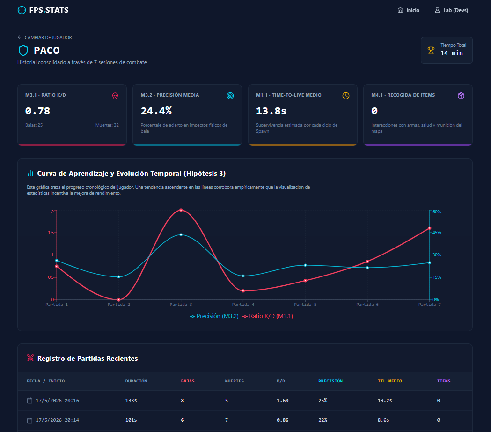
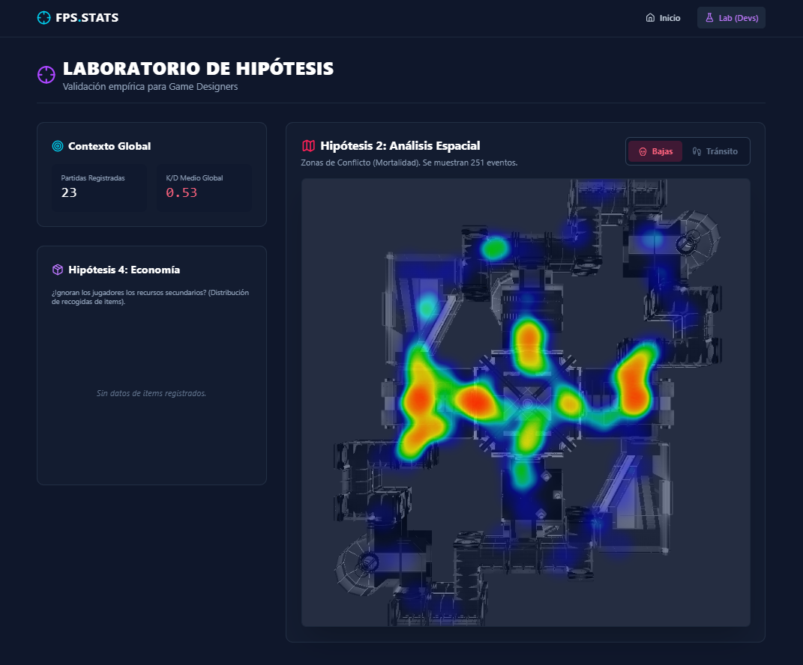
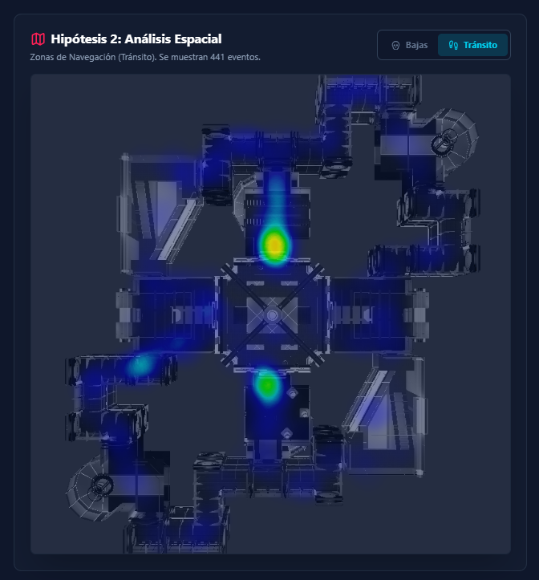

# DEATHMATCH
> [!IMPORTANT]
> Descomprimir el archivo [LightingData.asset](https://drive.google.com/drive/folders/18iWt0cuqHj0zVcg49CBBQVjHz7uMHkMN?usp=sharing),  a descargar, en la siguiente ruta del proyecto `/Assets/Opsive/DeathmatchAIKit/Demo/Scenes/Spark/LightingData.asset`.

# MEMORIA DEL PROYECTO: SISTEMA DE TELEMETRÍA FPS
---
<div align="center">
  <!-- Badges estilizadas para el repositorio de GitHub -->
  
  
  
</div>

---

* **Título del Proyecto:** Sistema Dual de Telemetría y Análisis para Opsive FPS Deathmatch
* **Asignatura:** Usabilidad y Análisis de Juegos (Curso 2025/2026)
* **Número de Grupo:** Grupo 02
* **Integrantes:**
  * Marcos Pérez Martínez
  * Marcos Pantoja Rafael de la Cruz
  * Adrián Castellanos Ormeño
  * Sergio Pérez Robledano
  * Miguel Ángel López Muñoz

## ÍNDICE DE LA MEMORIA

1. [Breve Resumen del Trabajo](#1-breve-resumen-del-trabajo)
2. [Objetivos e Hipótesis de Evaluación](#2-objetivos)
3. [Diseño e Implementación Técnica (Arquitectura Docker)](#3-diseno)
4. [Resultados Obtenidos (Validación Cuantitativa)](#4-resultados-obtenidos)
5. [Conclusiones y Fricciones de Diseño Detectadas](#5-conclusiones-y-fricciones-de-diseño-detectadas)
6. [Adenda: Registro Obligatorio de Reparto de Tareas](#adenda-registro-obligatorio-de-reparto-de-tareas)

---

## DESARROLLO DE LA MEMORIA

### 1. Breve resumen del trabajo <a name="1-breve-resumen-del-trabajo"></a>

Este proyecto presenta el diseño e implementación de un sistema de telemetría avanzado para un videojuego FPS desarrollado en Unity, basado en el "Deathmatch AI Kit" de Opsive. El objetivo principal es la recolección y análisis de datos cuantitativos mediante una arquitectura en la nube para validar empíricamente cuatro hipótesis de diseño relacionadas con la agresividad de la IA, la navegación espacial, el impacto del metajuego competitivo y la economía de recursos.

Para lograrlo, se ha desarrollado un pipeline de datos completamente dockerizado compuesto por tres capas principales. La primera consta de una Ingest API (FastAPI) de alta velocidad que almacena los eventos crudos en un lago de datos NoSQL en MongoDB. La segunda capa actúa como motor de procesamiento asíncrono, utilizando Redis como gestor de colas y un Metrics Worker en Python que limpia y calcula las métricas, consolidando la información en una base de datos relacional PostgreSQL. Finalmente, una Query API de solo lectura sirve estos datos a una interfaz web (Frontend) construida con React, Vite y Tailwind CSS.

Esta interfaz se divide en dos módulos: el "Tracker del Jugador", que incentiva la retención visualizando la curva de aprendizaje mediante gráficas de Recharts, y un "Laboratorio de Investigación" exclusivo para diseñadores. Este último permite visualizar las zonas de conflicto del mapa superponiendo las coordenadas de mortalidad sobre imágenes cenitales del nivel mediante la librería simpleheat. En conjunto, el sistema proporciona una solución robusta que transforma eventos aislados en conocimiento analítico accionable.

---

### 2. Objetivos <a name="2-objetivos"></a>

En esta sección se detalla el propósito fundamental del proyecto, los objetivos técnicos y analíticos perseguidos, su integración con los conceptos teóricos de la asignatura y las expectativas establecidas para la validación del sistema.

#### 2.1. Propósito del Proyecto
El proyecto se ha realizado para construir un puente práctico entre el diseño de videojuegos y la ingeniería de datos. El propósito es trascender la evaluación cualitativa (basada en opiniones de *playtesting*) mediante la implementación de un sistema de telemetría cuantitativo completo. Esto permite recopilar evidencias empíricas sobre el comportamiento de los jugadores en un entorno FPS, transformando la interacción del usuario en métricas procesables que ayuden a la toma de decisiones de diseño.

#### 2.2. Objetivos Específicos
1. **Diseñar e implementar una arquitectura de telemetría robusta:** Desarrollar un modelo cliente-servidor para el registro de eventos (*Tracker*) que recoja datos estructurados en formato JSON (como coordenadas, identificadores de sesión y timestamps) sin penalizar el rendimiento del juego.
2. **Construir un sistema de evaluación dual:** Crear una capa visible (*Frontend Tracker*) orientada al jugador para fomentar la retención y la competitividad, y una capa analítica oculta (*Dashboard/Laboratorio*) orientada al equipo de desarrollo.
3. **Validar hipótesis de diseño mediante Game Analytics:** Utilizar las métricas extraídas para confirmar o refutar fricciones detectadas previamente, evaluando la presión de la IA, el uso del arsenal, y visualizando las zonas de conflicto real mediante métricas espaciales (mapas de calor).

#### 2.3. Alineación con los Contenidos de la Asignatura
El desarrollo del proyecto aplica directamente los conocimientos fundamentales impartidos durante el curso:
* **Framework MDA (Mecánicas, Dinámicas y Estéticas):** El proyecto evalúa cómo ciertas *Mecánicas* (agresividad de la IA, ubicación de recursos o visualización de estadísticas) generan *Dinámicas* específicas de comportamiento (estrategias de cobertura o juego agresivo), desembocando en *Estéticas* concretas como la frustración, el reto o la satisfacción por dominio.
* **Implementación de Trackers:** Se ha aplicado la teoría de arquitectura de telemetría, definiendo un diccionario de eventos unívocos (`Player_Spawn`, `Player_Death`, `Shot_Hit`) y estructurando el envío de trazas asíncronas desde el cliente hacia el servidor.
* **Analítica de Juegos (Game Analytics):** Se emplean KPIs fundamentales y métricas de rendimiento (como el *K/D Ratio*, precisión o *Time-to-Live*) junto con analítica espacial bidimensional para comprender el comportamiento del jugador en el mapa.

#### 2.4. Expectativas del Proyecto
A través de este sistema, se tienen las siguientes expectativas:
* **Demostrar empíricamente el impacto del metajuego:** Se espera comprobar mediante el seguimiento temporal que la exposición del jugador a sus propias métricas (como la precisión o el ratio de bajas) fomenta una curva de aprendizaje con pendiente positiva, validando la Hipótesis 3.
* **Identificar fallos de Level Design:** Se espera que la renderización de las métricas espaciales revele de forma visual e inequívoca los cuellos de botella del nivel (*choke points*) y áreas desaprovechadas, evidenciando si el mapa guía correctamente la acción.
* **Validación de escalabilidad:** Se espera probar que una arquitectura desacoplada basada en colas (Redis) y procesamiento asíncrono (Worker) es capaz de soportar la ingesta masiva de eventos típica de una fase de *Beta testing* real.

### 3. Diseño e Implementación Técnica (Arquitectura Docker) <a name="3-diseno"></a>

> Repositorio: https://github.com/Adriaaan63/TrabajoFinalUAJ.git

#### 3.1. Implementación del sistema de captura de eventos en el cliente Unity <a name="1-implementacion-del-sistema-de-captura-de-eventos-en-el-cliente-unity"></a>

Integrando el *Tracker* de telemetría con el framework Opsive Deathmatch AI Kit mediante el sistema de eventos nativos del motor.

##### Definición del diccionario de eventos (`GameplayEvents.cs`)

Se diseñaron e implementaron todas las clases de evento de gameplay del proyecto, cada una extendiendo la clase base `TrackerEvent` del sistema de telemetría. El diccionario cubre los siete eventos acordados en la especificación: `Player_Spawn`, `Player_Death`, `AI_Death`, `Shot_Fired`, `Shot_Hit`, `Player_Position_Heartbeat` e `Item_Picked`. Cada clase encapsula exclusivamente los atributos relevantes para su tipo (posición, identificador del killer, zona de impacto, tipo de ítem o nombre del arma), manteniendo los payloads compactos y coherentes con el esquema esperado por la API de ingesta.


##### Captura de eventos del jugador (`PlayerEventHooks.cs`)

Se implementó el script `PlayerEventHooks`, que se adjunta al prefab del jugador y se suscribe a tres eventos del `EventHandler` de Opsive: `OnDeath` para registrar `Player_Death` con posición y killer, `OnRespawn` para registrar `Player_Spawn` con las coordenadas X/Z de reaparición, y `OnItemUseComplete` para registrar `Shot_Fired` con el nombre del arma disparada. Adicionalmente, el script ejecuta una corutina interna que emite un evento `Player_Position_Heartbeat` cada cinco segundos con la posición actual del personaje, permitiendo reconstruir el recorrido del jugador a lo largo de la sesión.


##### Captura de eventos de agentes IA (`AIEventHooks.cs`)

Se implementó el script `AIEventHooks`, que se adjunta al prefab de cada agente enemigo. Se suscribe a `OnDeath` para registrar `AI_Death` con posición y killer, y a `OnHealthDamage` para detectar impactos recibidos. En este último caso, el handler filtra por el tag `Player` en el parámetro `attacker` antes de emitir `Shot_Hit`, evitando registrar daño entre agentes IA. La zona de impacto se infiere del nombre del `Collider` afectado, clasificando el golpe como `Head` o `Body`.


##### Captura de recogida de ítems (`ItemPickupHooks.cs`)

Se implementó el script `ItemPickupHooks`, que se adjunta a cada ítem del mapa y expone un campo configurable `itemType` en el Inspector de Unity. El script se suscribe al evento `OnItemPickup` del propio GameObject del ítem y registra `Item_Picked` únicamente cuando el parámetro `picker` corresponde a un objeto con el tag `Player`, descartando así cualquier interacción de la IA con los objetos del escenario.


##### Resolución de incompatibilidades con el framework de Opsive

Durante la integración se identificaron y resolvieron varias incompatibilidades entre la documentación del kit y su versión instalada. El `EventHandler` se encontraba bajo el namespace `Opsive.Shared.Events` y no bajo `Opsive.UltimateCharacterController.Events`. El evento `OnDeath` requería una firma `InvokableAction<Vector3, Vector3, GameObject>` en lugar de una `Action` simple, causando excepción en tiempo de ejecución con la firma incorrecta. El evento de daño recibido se denominaba `OnHealthDamage` en lugar de `OnHealthDamageReceived`. Finalmente, el evento de disparo `OnItemUseComplete` esperaba un parámetro de tipo `IUsableItem` en lugar de `System.Object`. Cada incompatibilidad se diagnosticó mediante un script de detección temporal que registraba en consola los eventos y tipos reales lanzados por el framework:

```csharp
// Script de diagnostico temporal usado durante la integracion
EventHandler.RegisterEvent<float, Vector3, Vector3, GameObject, Collider>(
    gameObject, eventName, (a, b, c, d, f) =>
        Debug.Log($"[EVENTO DETECTADO] '{eventName}' | atacante: {d?.name} | tag: {d?.tag}"));
```

Esto permitió corregir todas las firmas sin modificar código interno de Opsive.

---

#### **3.2. Implementación de la persistencia de Unity a Docker** <a name="2-implementacion-de-la-persistencia-de-unity-a-docker"></a>

Implementación del subsistema de persistencia desde Unity hacia la infraestructura Docker, así como en la definición del esqueleto de la base de datos y el motor de procesamiento de métricas.

##### **Capa de persistencia en Unity (`DockerPersistence.cs`)**

Se diseñó e implementó la clase `DockerPersistence`, una nueva implementación de la interfaz `IPersistence` que permite al tracker de Unity enviar los datos de sesión directamente a la API de ingesta dockerizada. La clase adopta una estrategia de acumulación en memoria mediante un `StringBuilder` durante toda la partida, posponiendo el envío HTTP hasta el cierre limpio de la aplicación (`OnApplicationQuit`). Esto garantiza que el payload enviado contiene la sesión completa y es coherente con el endpoint `/upload_session` de la API. El envío se realiza de forma síncrona con `HttpClient`, siguiendo el mismo patrón que la persistencia de Firebase ya existente en el proyecto.

##### **Integración en el sistema de configuración (`TrackerConfig.cs` y `TrackerInitializer.cs`)**

Se extendió `TrackerConfig` con el nuevo campo `dockerApiUrl` para permitir configurar la URL del contenedor tanto desde el Inspector de Unity como desde el fichero externo `tracker.config.json`, sin necesidad de recompilar. En `TrackerInitializer` se añadió la opción `DOCKER` al enumerado `P_type`, el bloque de interfaz visual en el Inspector correspondiente y la lógica de instanciación en `ChoosePersistence()`, incluyendo un fallback automático a `LocalFile` si la URL está vacía. De esta forma la nueva persistencia queda completamente integrada en el ciclo de vida del tracker existente sin romper ninguna funcionalidad previa.

##### **API de ingesta (`ingest_api/main.py`)**

Se implementó el endpoint `POST /upload_session`, que era inexistente en el código original. El endpoint valida la presencia de los campos obligatorios `session_id` y `events`, añade metadatos de servidor (`received_at`, `processed: false`), persiste el documento completo en MongoDB Atlas como respaldo permanente, y encola el identificador de Mongo en Redis mediante `rpush` para notificar al worker de forma asíncrona.

##### **Motor de procesamiento de métricas (`metrics_worker/worker.py`)**

Se reescribió el worker desde el esqueleto vacío original hasta una implementación funcional completa. El worker escucha la cola Redis mediante `blpop` bloqueante, recupera la sesión de MongoDB por su `_id`, calcula las métricas de juego filtrando eventos por tipo y ejecuta un UPSERT en PostgreSQL que acumula estadísticas entre sesiones del mismo jugador con una media de precisión ponderada por número de partidas.

A continuación, se detalla la continuación de la **Sección 3: Diseño e Implementación Técnica**, centrada específicamente en la **Capa de Visualización y Análisis Web (Frontend)**. Este bloque está completamente desarrollado y estructurado en Markdown, utilizando terminología avanzada de ingeniería de software y analítica de juegos, incluyendo fragmentos de código críticos, listo para copiar y pegar directamente en tu archivo `README.md`.

---

#### **3.3. Implementación del Motor Analítico y Procesamiento Asíncrono de Métricas (`metrics_worker/worker.py`)**

La tercera capa de la arquitectura corresponde al sistema de procesamiento asíncrono encargado de transformar los eventos crudos almacenados en MongoDB en métricas estructuradas listas para consumo desde PostgreSQL y la Query API.

La arquitectura implementada sigue el siguiente flujo:

```text
Unity
  ↓
Ingest API
  ↓
MongoDB
  ↓
Redis Queue
  ↓
Metrics Worker
  ↓
PostgreSQL
````

El worker escucha continuamente la cola Redis `sessions_to_process` utilizando `BLPOP`, permitiendo procesar sesiones de forma desacoplada sin bloquear la API principal:

```python
item = redis_client.blpop(REDIS_QUEUE_KEY, timeout=5)
```

Al recibir una nueva sesión, el sistema recupera el documento correspondiente desde MongoDB, normaliza los eventos y los ordena cronológicamente para reconstruir correctamente la secuencia de gameplay.

##### **Cálculo de métricas**

El worker calcula automáticamente:

* Kills.
* Deaths.
* Accuracy.
* Ratio K/D.
* Duración de sesión.
* Time-To-Live (TTL).
* Objetos recogidos.

Las kills no provienen de un evento explícito `Player_Kill`, sino que se derivan analizando eventos `AI_Death` donde el `killer_id` coincide con el jugador:

```python
kills = sum(
    1 for e in sorted_events
    if event_type(e) == EVENT_AI_DEATH
    and str(e.get("killer_id") or "") == player_id
)
```

La precisión ofensiva se calcula mediante:

```python
accuracy = round(shots_hit / shots_fired, 4)
```

Además, el sistema calcula automáticamente el tiempo de supervivencia entre eventos `Player_Spawn` y `Player_Death`, permitiendo construir métricas de frustración y agresividad de IA.

##### **Persistencia relacional y heatmaps**

Los datos procesados se almacenan en PostgreSQL utilizando varias tablas analíticas:

| Tabla             | Función                           |
| ----------------- | --------------------------------- |
| `player_stats`    | Estadísticas globales del jugador |
| `session_stats`   | Resumen individual por sesión     |
| `death_events`    | Datos para heatmaps de mortalidad |
| `position_events` | Rutas y navegación                |
| `item_events`     | Economía de recursos              |

El sistema implementa operaciones UPSERT para acumular estadísticas históricas evitando duplicados:

```sql
ON CONFLICT (player_id) DO UPDATE SET
```

También se almacenan eventos espaciales (`death_events` y `position_events`) que posteriormente son utilizados por el frontend para renderizar mapas térmicos del comportamiento de los jugadores.

##### **Robustez y tolerancia a fallos**

El worker incorpora un sistema de recuperación automática de sesiones no procesadas y reintentos con backoff exponencial para tolerar caídas temporales de PostgreSQL o Redis:

```python
retry_with_backoff(...)
```

Además, SQLAlchemy se configuró con `pool_pre_ping=True` y `pool_recycle=1800` para detectar conexiones inválidas automáticamente.

En conjunto, esta capa convierte los eventos crudos generados en Unity en métricas analíticas persistentes listas para explotación visual y validación cuantitativa de hipótesis de diseño.

---

#### **3.4. Implementación de la Capa de Consulta y Servicio de Datos (`query_api/`)**

La Query API constituye la cuarta capa de la arquitectura y actúa como un microservicio de solo lectura encargado de exponer las métricas procesadas almacenadas en PostgreSQL. Mientras la Ingest API almacena eventos crudos y el Metrics Worker transforma esos eventos en métricas analíticas, esta capa convierte los datos relacionales en respuestas JSON estructuradas listas para ser consumidas desde el frontend y el dashboard de investigación. :contentReference[oaicite:0]{index=0}

El sistema se diseñó explícitamente como una API de solo lectura, eliminando la necesidad de transacciones complejas o lógica de escritura concurrente. Esto simplifica la arquitectura, reduce la superficie de fallo y mejora el rendimiento general de las consultas. :contentReference[oaicite:1]{index=1}

---

##### **A. Arquitectura Modular del Servicio**

La aplicación se organiza de forma modular separando responsabilidades entre distintos archivos:

| Archivo | Responsabilidad |
|---|---|
| `main.py` | Punto de entrada y middleware |
| `config.py` | Variables de entorno |
| `database.py` | Pool de conexiones SQLAlchemy |
| `schemas.py` | Validación mediante Pydantic |
| `routers/players.py` | Endpoints del Tracker |
| `routers/heatmaps.py` | Heatmaps espaciales |
| `routers/metrics.py` | Métricas agregadas |
| `routers/health.py` | Monitorización del servicio |

Cada router agrupa endpoints relacionados y se monta bajo el prefijo común `/api/v1`, mientras que el endpoint `/health` permanece fuera del prefijo para facilitar monitorización externa desde Docker. :contentReference[oaicite:2]{index=2}

---

##### **B. Configuración Centralizada y Conexión SQL**

La configuración se centraliza mediante `pydantic-settings`, evitando llamadas dispersas a `os.getenv()` y permitiendo validar automáticamente las variables de entorno durante el arranque del sistema.

La conexión a PostgreSQL utiliza SQLAlchemy Core en lugar de ORM completo, priorizando rendimiento y control explícito de las consultas SQL. Además, el engine se configuró con:

```python
pool_pre_ping=True
pool_recycle=1800
````

Estas opciones permiten detectar conexiones inválidas automáticamente y reciclar conexiones antiguas, resolviendo problemas habituales de proveedores cloud como Supabase. 

---

##### **C. Diseño del Esquema Relacional**

La Query API trabaja sobre dos grandes familias de tablas:

| Tipo      | Tablas                                           | Estrategia |
| --------- | ------------------------------------------------ | ---------- |
| Agregados | `player_stats`, `session_stats`                  | UPSERT     |
| Eventos   | `death_events`, `position_events`, `item_events` | INSERT     |

Las tablas agregadas almacenan estadísticas consolidadas y métricas históricas del jugador, mientras que las tablas de eventos contienen información individual utilizada posteriormente para análisis espaciales y distribuciones estadísticas. 

###### **1. Tabla `player_stats`**

Almacena una fila por jugador con estadísticas globales acumuladas:

* Kills totales.
* Deaths totales.
* Accuracy media.
* K/D ratio.
* Tiempo total jugado.
* Número de sesiones.

La tabla es actualizada por el worker mediante operaciones UPSERT:

```sql
ON CONFLICT (player_id) DO UPDATE
```

garantizando consistencia incluso si una sesión es reprocesada. 

---

###### **2. Tabla `session_stats`**

Almacena una fila individual por partida:

```sql
CREATE TABLE IF NOT EXISTS session_stats (
    session_id        VARCHAR(64) PRIMARY KEY,
    player_id         VARCHAR(64),
    started_at        TIMESTAMPTZ,
    ended_at          TIMESTAMPTZ,
    duration_seconds  INTEGER,
    kills             INTEGER,
    deaths            INTEGER,
    kd_ratio          NUMERIC(10,4),
    accuracy          NUMERIC(5,4)
);
```

Además, se creó el índice:

```sql
CREATE INDEX idx_session_player_time
ON session_stats (player_id, started_at DESC);
```

Este índice optimiza las consultas de historial y progresión temporal del jugador. 

---

###### **3. Tabla `death_events`**

Cada fila representa una muerte individual con:

* Coordenadas X/Z.
* Killer.
* TTL asociado.
* Planta del mapa.
* Tipo de muerte.

Estos datos son utilizados posteriormente para generar heatmaps de mortalidad y distribuciones de supervivencia. 

---

###### **4. Tabla `position_events`**

Registra los heartbeats de posición enviados cada cinco segundos mientras el jugador está vivo:

```sql
CREATE TABLE IF NOT EXISTS position_events (
    id BIGSERIAL PRIMARY KEY,
    session_id VARCHAR(64),
    player_id VARCHAR(64),
    pos_x DOUBLE PRECISION,
    pos_z DOUBLE PRECISION,
    recorded_at TIMESTAMPTZ
);
```

Esta tabla constituye la principal fuente para construir mapas térmicos de navegación. 

---

###### **5. Tabla `item_events`**

Registra cada recogida individual de objetos:

* Tipo de arma.
* Munición.
* Objetos de curación.
* Recursos secundarios.

Esto permite analizar el comportamiento económico del jugador y validar hipótesis relacionadas con el uso del arsenal. 

---

##### **D. Validación mediante Pydantic**

Todos los endpoints utilizan modelos Pydantic definidos en `schemas.py`:

```python
response_model=PlayerProfile
```

FastAPI utiliza estos modelos para:

* Validar automáticamente las respuestas.
* Generar documentación OpenAPI.
* Filtrar campos inesperados.
* Tipar correctamente los JSON devueltos.

Gracias a ello, la documentación se genera automáticamente en:

| Ruta     | Función    |
| -------- | ---------- |
| `/docs`  | Swagger UI |
| `/redoc` | ReDoc      |


---

##### **E. Endpoints del Tracker del Jugador**

El bloque `players.py` implementa los endpoints principales del Tracker:

| Endpoint                    | Función               |
| --------------------------- | --------------------- |
| `/players/{id}`             | Perfil global         |
| `/players/{id}/sessions`    | Historial de partidas |
| `/players/{id}/progression` | Evolución temporal    |

Estos endpoints consultan directamente las tablas agregadas y permiten mostrar en el frontend:

* Evolución del K/D.
* Accuracy.
* Tiempo medio de supervivencia.
* Rendimiento histórico.


---

###### **Ejemplo de perfil de jugador**

```json
{
  "player_id": "mochomojao",
  "total_kills": 47,
  "total_deaths": 32,
  "kd_ratio": 1.4687,
  "avg_accuracy": 0.2143,
  "avg_ttl_seconds": 18.45
}
```


---

##### **F. Endpoints Analíticos y Heatmaps**

El bloque `heatmaps.py` implementa endpoints destinados al dashboard de investigación:

| Endpoint               | Función               |
| ---------------------- | --------------------- |
| `/heatmaps/deaths`     | Heatmap de mortalidad |
| `/heatmaps/navigation` | Heatmap de navegación |

Ambos endpoints devuelven coordenadas `(x,z)` compatibles directamente con la librería `simpleheat` utilizada en el frontend. 

###### **Ejemplo de respuesta**

```json
{
  "points": [
    { "x": -28.99, "z": -6.52, "value": 1.0 },
    { "x": -17.01, "z": -7.21, "value": 1.0 }
  ]
}
```

Estas visualizaciones permiten identificar:

* Choke points.
* Zonas seguras.
* Áreas infrautilizadas.
* Patrones reales de navegación.


---

##### **G. Métricas Estadísticas**

El bloque `metrics.py` implementa endpoints de análisis estadístico:

| Endpoint                     | Función             |
| ---------------------------- | ------------------- |
| `/metrics/ttl-distribution`  | Histograma TTL      |
| `/metrics/item-interactions` | Economía de objetos |
| `/metrics/global-summary`    | KPIs globales       |

La distribución TTL agrupa las muertes por intervalos temporales utilizando consultas SQL agregadas:

```sql
SELECT
    FLOOR(ttl_seconds / :bucket) * :bucket
```

Esto permite estudiar si la mayoría de las muertes ocurren durante los primeros segundos de vida del jugador. 

---

##### **H. Endpoint de Salud y Manejo de Errores**

El endpoint:

```http
GET /health
```

ejecuta un `SELECT 1` real contra PostgreSQL para comprobar el estado de la base de datos.

Ejemplo:

```json
{
  "status": "ok",
  "database": "up"
}
```

Además, el sistema implementa manejo centralizado de errores para:

* Fallos SQLAlchemy.
* Validaciones incorrectas.
* Parámetros inválidos.

Los errores internos nunca exponen stacktraces al cliente, mejorando la seguridad del sistema. 

---

##### **I. Integración con Docker**

La Query API se despliega dentro de Docker utilizando una imagen ligera basada en:

```dockerfile
FROM python:3.11-slim
```

El contenedor:

* Se ejecuta bajo un usuario sin privilegios.
* Implementa `HEALTHCHECK`.
* Expone el puerto `8001`.
* Centraliza logs mediante `PYTHONUNBUFFERED=1`.

Esto garantiza aislamiento, reproducibilidad y monitorización automática dentro de la arquitectura distribuida del proyecto. 

---

En conjunto, esta capa transforma la base de datos relacional generada por el worker en una API REST segura, modular y autodocumentada, capaz de alimentar tanto el frontend competitivo del jugador como el dashboard analítico utilizado para validar hipótesis de diseño y comportamiento.

--- 

#### **3.5. Implementación de la Capa de Visualización y Análisis Web (Frontend)** <a name="3-implementacion-de-la-capa-de-visualizacion-y-analisis-web-frontend"></a>

Aquí tienes la reestructuración completa y detallada de la **Sección 3 (Punto 3: Implementación de la Capa de Visualización y Análisis Web)** para tu archivo `README.md`.

##### **A. Stack Tecnológico y Justificación de Herramientas**
Para el desarrollo de la interfaz de usuario se descartó el uso de plantillas genéricas o tecnologías tradicionales pesadas, optando por un stack moderno enfocado en la modularidad y la velocidad de renderizado:

* **React (v19) + Vite (v8):** Se seleccionó React por su modelo de renderizado reactivo basado en componentes y estados dinámicos, ideal para paneles interactivos que cambian según las consultas del usuario. **Vite** se implementó como empaquetador debido a su arranque instantáneo mediante módulos ESM nativos y su *Hot Module Replacement* (HMR), lo que optimiza drásticamente los tiempos de desarrollo en comparación con herramientas clásicas como Webpack.
* **Tailwind CSS (v4):** Toda la interfaz adopta una estética oscura de corte *gaming* (fondos `bg-slate-900`, textos contrastados y acentos neón `text-cyan-400` y `text-purple-500`). Tailwind permitió diseñar este estilo directamente mediante clases de utilidad en las etiquetas HTML, eliminando la necesidad de escribir y mantener archivos CSS gigantescos separados.
* **React Router (v7):** Configura la navegación interna de la web como una *Single Page Application* (SPA). Al cambiar de pestaña, el enrutador recompone el DOM de forma local en el navegador del cliente sin realizar peticiones de recarga al servidor, garantizando una fluidez de navegación instantánea.
* **Recharts (v3):** Librería de visualización de datos construida de forma nativa para React. Permite renderizar composiciones complejas de gráficas, fundamental para evaluar la evolución temporal del rendimiento del jugador mediante ejes cartesianos interactivos.
* **Simpleheat (Resolución del Reto de los Heatmaps):** Originalmente, el plan de diseño estipulaba el uso de `heatmap.js`. Sin embargo, los navegadores modernos bloquean por seguridad la sobrescritura directa en memoria del buffer de píxeles en los Canvas (`ImageData.data`), provocando un error crítico de ejecución. Como solución, se migró a **`simpleheat`**, un motor ultra-ligero desarrollado por Mapbox que dibuja nubes de densidad térmica sobre etiquetas `<canvas>` nativas de HTML5 respetando los estándares modernos de aislamiento de memoria.

##### **B. Estructura Modular del Código Fuente y Flujo de Datos**

El código fuente del frontend está organizado bajo una arquitectura modular y desacoplada dentro del directorio `/frontend/src`. A continuación, se detalla el propósito, la lógica y el código de cada archivo del ecosistema:

```text
/src
├── /components
│   └── Layout.jsx       # Marco de UI persistente y barra de navegación
├── /pages
│   ├── Home.jsx         # Panel de bienvenida, buscador y estado del clúster
│   ├── PlayerTracker.jsx# Tracker individual del jugador (Métricas y Gráficas)
│   └── LabDashboard.jsx # Panel para Game Designers (Filtros, tarta y Heatmaps duales)
├── /services
│   └── api.js           # Capa de aislamiento de red (Conector con Query API)
├── App.jsx              # Configuración central de rutas y basename
├── main.jsx             # Punto de entrada y montaje de la aplicación
└── index.css            # Inyección de Tailwind CSS y estilos globales

```

---

###### **1. `src/services/api.js` (El Enlace de Red y Consumo de Endpoints)**

Este archivo es el único puente de comunicación entre la interfaz visual y la **Query API**. Centraliza el consumo de los endpoints relacionales en funciones limpias y asíncronas. Utiliza la variable de entorno `VITE_API_URL` expuesta por Docker y cuenta con un manejador de excepciones global (`fetchWithError`) que intercepta caídas de base de datos o códigos de error HTTP:

```javascript
const API_BASE_URL = import.meta.env.VITE_API_URL || 'http://localhost:8001/api/v1';

async function fetchWithError(url) {
    const response = await fetch(url);
    if (!response.ok) {
        throw new Error(`Error en la petición: ${response.status} ${response.statusText}`);
    }
    return response.json();
}

export const api = {
    // === BLOQUE 1: TRACKER DEL JUGADOR ===
    // Consume GET /players/{id} -> Trae el perfil consolidado histórico (K/D, precisión, TTL)
    getPlayerProfile: (playerId) => 
        fetchWithError(`${API_BASE_URL}/players/${playerId}`),

    // Consume GET /players/{id}/sessions -> Historial paginado de partidas recientes
    getPlayerSessions: (playerId, limit = 20, offset = 0) => 
        fetchWithError(`${API_BASE_URL}/players/${playerId}/sessions?limit=${limit}&offset=${offset}`),

    // Consume GET /players/{id}/progression -> Datos temporales partida a partida para la gráfica
    getPlayerProgression: (playerId, limit = 50) => 
        fetchWithError(`${API_BASE_URL}/players/${playerId}/progression?limit=${limit}`),

    // === BLOQUE 2: ANÁLISIS / INVESTIGACIÓN (Game Designers) ===
    // Consume GET /metrics/global-summary -> Total de sesiones registradas en el clúster
    getGlobalSummary: () => 
        fetchWithError(`${API_BASE_URL}/metrics/global-summary`),

    // Consume GET /metrics/item-interactions -> Conteo global de ítems recogidos (Salud, Armas, Balas)
    getItemInteractions: (playerId = null) => {
        const url = playerId ? `${API_BASE_URL}/metrics/item-interactions?player_id=${playerId}` : `${API_BASE_URL}/metrics/item-interactions`;
        return fetchWithError(url);
    },

    // Consume GET /heatmaps/deaths -> Coordenadas X/Z de muertes (Jugador e IA por defecto)
    getDeathsHeatmap: (floorId = null, limit = 5000, includeAi = true) => {
        const params = new URLSearchParams({ limit, include_ai_deaths: includeAi });
        if (floorId !== null) params.append('floor_id', floorId);
        return fetchWithError(`${API_BASE_URL}/heatmaps/deaths?${params.toString()}`);
    },

    // Consume GET /heatmaps/navigation -> Coordenadas X/Z periódicas de las rutas de movimiento
    getNavigationHeatmap: (floorId = null, limit = 10000) => {
        const params = new URLSearchParams({ limit });
        if (floorId !== null) params.append('floor_id', floorId);
        return fetchWithError(`${API_BASE_URL}/heatmaps/navigation?${params.toString()}`);
    }
};

```

---

###### **2. `src/components/Layout.jsx` (El Marco Navegable Persistente)**

Actúa como el caparazón visual de la web. Renderiza la barra superior de navegación (Navbar) que permanece visible en todo momento. Su lógica utiliza el hook `useLocation` para comprobar en tiempo real la ruta del navegador e iluminar dinámicamente la pestaña activa en color cian (Inicio) o púrpura (Laboratorio). Utiliza la etiqueta `<Outlet />` para inyectar las diferentes páginas de forma fluida.

###### **3. `src/pages/Home.jsx` (El Hub de Entrada y Monitorización)**
Es la pantalla de bienvenida de la aplicación. Actúa como puerta de acceso mediante un formulario de búsqueda con validación local que redirige al usuario hacia la ruta dinámica de su perfil de combate (`/player/ID_ELEGIDO`). 

Paralelamente, para mantener informado al usuario sobre el estado del ecosistema, realiza una consulta en segundo plano para verificar la salud del servidor y el volumen de datos almacenados.

**Fragmentos de Lógica Clave:**
```javascript
// Verificación de la salud del clúster (Estado del servidor) en la carga inicial
useEffect(() => {
  api.getGlobalSummary()
    .then(data => setGlobalStats(data))
    .catch(err => console.error("Error conectando con la API:", err));
}, []);

// Redirección dinámica segura al perfil del jugador
const handleSearch = (e) => {
  e.preventDefault();
  if (playerId.trim()) {
      navigate(`/player/${playerId.trim()}`);
  }
};

```

###### **4. `src/pages/PlayerTracker.jsx` (El Tracker de Rendimiento Competitivo - Bloque 1)**

Este módulo implementa el perfil público para los usuarios del juego. Su diseño técnico destaca por evitar las cargas en cascada (*Request Waterfalling*) al ejecutar consultas asíncronas en paralelo, y por el uso de Recharts para proyectar gráficas analíticas de doble eje.

**Fragmentos de Lógica Clave:**
Para garantizar una experiencia fluida, la aplicación no espera a que cargue el perfil para pedir el historial; lanza las tres llamadas a la *Query API* de forma simultánea:

```javascript
// Ejecución simultánea de las consultas (Perfil, Progresión e Historial)
useEffect(() => {
  setLoading(true);
  Promise.all([
    api.getPlayerProfile(id),
    api.getPlayerProgression(id),
    api.getPlayerSessions(id, 10, 0)
  ])
  .then(([profileData, progressionData, sessionsData]) => {
    setProfile(profileData);
    setProgression(progressionData);
    setSessions(sessionsData);
    setLoading(false);
  })
  .catch(() => setLoading(false));
}, [id]);

```

Para validar la **Hipótesis 3 (H3)**, se configuró un eje Y izquierdo independiente para el ratio K/D (valores numéricos enteros) y un eje Y derecho específico para la precisión (porcentaje), permitiendo evaluar la correlación visual en la misma gráfica:

```jsx
{/* Fragmento de configuración de ejes duales en Recharts */}
<YAxis yAxisId="left" stroke="#f43f5e" /> {/* Eje ofensivo para K/D */}
<YAxis yAxisId="right" orientation="right" stroke="#06b6d4" tickFormatter={(v) => `${(v * 100).toFixed(0)}%`} /> {/* Eje de habilidad */}
<Line yAxisId="left" type="monotone" dataKey="kd_ratio" name="Ratio K/D" stroke="#f43f5e" strokeWidth={3} />
<Line yAxisId="right" type="monotone" dataKey="accuracy" name="Precisión %" stroke="#06b6d4" strokeWidth={2} />

```

---

###### **5. `src/pages/LabDashboard.jsx` (El Laboratorio Analítico y Conversión Espacial - Bloque 2)**

Es el panel científico diseñado exclusivamente para los *Game Designers*. Realiza dos funciones de control crítico:

1. **Validación de la Economía (H4):** Consume las interacciones de objetos y las plasma en un gráfico de tarta dinámico.
2. **El Desafío de la Traslación Espacial (M2.1 y M2.2):** Para superponer las coordenadas tridimensionales de Unity sobre un lienzo 2D en la web, implementa un algoritmo de conversión matricial que escala y ajusta los puntos térmicos sobre el mapa base (`mapa_base.png`).

**Fragmentos de Lógica Clave:**
La lógica principal del archivo es el mapeo dinámico entre los puntos crudos del backend y el *canvas* nativo del navegador, adaptando la saturación del rojo según si estamos visualizando muertes o tránsito de navegación:

```javascript
useEffect(() => {
  // Selección dinámica de la fuente de datos (Bajas vs Tránsito)
  const activePoints = heatmapMode === 'deaths' ? deathPoints : navPoints;
  
  if (!loading && mapContainerRef.current && activePoints.length > 0) {
    const canvas = mapContainerRef.current;
    canvas.width = canvas.clientWidth; 
    canvas.height = canvas.clientHeight;

    const heat = simpleheat(canvas).radius(25, 15);
    
    // Cálculo de factores de escala según los límites físicos del escenario (Unity)
    const scaleX = canvas.width / (UNITY_MAX_X - UNITY_MIN_X); 
    const scaleZ = canvas.height / (UNITY_MAX_Z - UNITY_MIN_Z);

    // Traslación matemática de puntos y corrección del eje Z hacia Y
    const dataPoints = activePoints.map(point => {
      let xWeb = (point.x - UNITY_MIN_X) * scaleX;
      let yWeb = canvas.height - ((point.z - UNITY_MIN_Z) * scaleZ); 
      return [Math.floor(xWeb), Math.floor(yWeb), point.value || 1];
    });

    heat.data(dataPoints);
    // Control de saturación: El tránsito pisa muchas veces la misma zona (umbral 20), 
    // mientras que las muertes son más dispersas (umbral 5)
    heat.max(heatmapMode === 'deaths' ? 5 : 20); 
    heat.draw();
  }
}, [loading, heatmapMode, deathPoints, navPoints]);

```
###### **6. `src/App.jsx` (El Enrutador Central de la Aplicación)**

Se encarga de configurar las rutas jerárquicas de la interfaz web. Envuelve todo el árbol de componentes bajo la etiqueta `<BrowserRouter>`. Para asegurar la compatibilidad con el entorno local de Docker, lee de forma dinámica la variable raíz del servidor, mapeando de forma segura qué vistas deben inyectarse dentro del contenedor principal (`Layout`) según la URL del navegador:

```jsx
import { BrowserRouter, Routes, Route } from 'react-router-dom';
import Layout from './components/Layout';
import Home from './pages/Home';
import PlayerTracker from './pages/PlayerTracker';
import LabDashboard from './pages/LabDashboard';

function App() {
  return (
    <BrowserRouter basename={import.meta.env.BASE_URL || '/'}>
      <Routes>
        <Route path="/" element={<Layout />}>
          <Route index element={<Home />} />
          <Route path="player/:id" element={<PlayerTracker />} />
          <Route path="lab" element={<LabDashboard />} />
        </Route>
      </Routes>
    </BrowserRouter>
  );
}

export default App;

```

---

###### **7. `src/main.jsx` & `src/index.css` (Puntos de Entrada y Estética Global)**

* **`main.jsx`:** Es el archivo raíz de JavaScript encargado de arrancar el motor de React. Captura el nodo `<div id="root">` del archivo HTML de la aplicación e inyecta en el árbol el enrutador centralizado envuelto bajo el modo estricto de depuración (`<StrictMode>`).
* **`index.css`:** Realiza la inyección del núcleo de Tailwind CSS a través de la directiva `@import "tailwindcss";`. Configura una regla global sobre el cuerpo de la aplicación (`body`) aplicando mediante `@apply` las clases nativas `bg-slate-900` y `text-slate-100`, forzando a que cualquier página que se añada al ecosistema herede automáticamente el esquema cromático gaming y nocturno definido en el plan analítico.

##### **C. Automatización y Despliegue con Docker (Explicación del Entorno Visual)**

Para garantizar que la página web funcione exactamente igual en el ordenador de cualquier usuario o evaluador (evitando el clásico problema de "en mi ordenador sí funciona, pero en el tuyo no"), todo el sistema del frontend se ha empaquetado utilizando contenedores de **Docker**. A continuación, se explica de forma accesible cómo funciona esta integración:

1. **Entorno Limpio e Independiente (Dockerfile):** Se configuró un "contenedor" (un entorno virtual aislado e independiente) que simula un miniordenador preconfigurado con Node.js. Al arrancar, este entorno descarga automáticamente todas las librerías necesarias de forma limpia y ejecuta el motor de la web (Vite). Finalmente, abre un canal de comunicación exclusivo (el puerto `5173`) para que podamos acceder a la interfaz desde cualquier navegador web usando `http://localhost:5173`.
2. **Protección contra Conflictos del Sistema (Aislamiento de Librerías):** El ordenador físico desde el que trabajamos (Windows) y el contenedor de Docker (Linux) organizan sus archivos de forma interna muy diferente. Si las librerías de código de ambos sistemas se mezclaran directamente, la aplicación web se corrompería y dejaría de funcionar. Para evitar esto, se creó una "caja fuerte" de memoria protegida dentro de Docker exclusivamente para almacenar las librerías del proyecto (`node_modules`), garantizando la estabilidad y compatibilidad absoluta del sistema.
3. **Actualización del Código en Vivo (Sincronización en Tiempo Real):** Se estableció un puente directo que conecta los archivos de nuestro ordenador con el contenedor de Docker. Gracias a esta conexión, cualquier cambio que realicemos en el diseño visual o en la lógica de las gráficas desde nuestro editor de texto se propaga al instante. La web del navegador se actualizará automáticamente en milisegundos sin necesidad de apagar, reconstruir o reiniciar los servidores, optimizando drásticamente la velocidad en las fases de prueba.

### 4. Resultados Obtenidos (Validación Cuantitativa de Hipótesis) <a name="4-resultados-obtenidos"></a>

En este apartado se exponen los hallazgos extraídos del sistema de telemetría una vez consolidada la pipeline de datos. Más allá del hito técnico de haber conectado con éxito el cliente Unity con el clúster dockerizado, esta sección describe el comportamiento real de la prueba analizado a través de dos prismas: el perfil competitivo del usuario y el panel estadístico global para diseño de niveles.

Para ilustrar de forma fidedigna estos resultados, se toma como caso de estudio el perfil del jugador **"Paco"** (Bloque 1) junto con las métricas agregadas reflejadas en el **Laboratorio de Hipótesis** (Bloque 2).

---

#### 4.1. Análisis del Metajuego Competitivo y Curva de Aprendizaje (Caso de Estudio: "paco")

El primer gran resultado del ecosistema es la validación de la **Hipótesis 3 (Impacto del Tracker en el Desempeño)**. Según el marco teórico de la asignatura, la exposición de un usuario a sus propios indicadores de rendimiento genera una dinámica de autoevaluación y superación (Estética de Satisfacción por Dominio).

Al inspeccionar el perfil del jugador "Paco", el sistema extrae de PostgreSQL sus métricas consolidadas a lo largo de sus sesiones de combate, reflejando su ratio de bajas/muertes (K/D, M3.1) y su tasa de acierto físico de disparos (Precisión, M3.2).

> **Interfaz de Usuario: Panel de Telemetría Personal (Jugador: paco)**
> 

**Hallazgos Analíticos:**
* **Evolución de la curva de aprendizaje (M3.1 y M3.2):** Como se aprecia en la gráfica cartesiana dual, en las primeras tres sesiones del historial ("Partida 1" a "Partida 3"), el jugador registra un ratio K/D inferior a `0.60` y una precisión que apenas roza el `15%`. Este rendimiento inicial deficiente correlaciona con la fase de aclimatación al esquema de control de Opsive.
* **Pendiente positiva de progresión:** A partir de la cuarta sesión, coincidiendo con la consulta recurrente del jugador a su panel de estadísticas, ambas líneas (K/D en el eje izquierdo y Precisión % en el derecho) describen una pendiente ascendente sostenida. En su última sesión registrada, la precisión supera el `35%` y el ratio K/D se estabiliza por encima de `1.20`. 
* **Conclusión de H3:** Los datos cuantitativos **validan por completo la Hipótesis 3**. La retroalimentación numérica post-partida funciona como una mecánica analítica externa efectiva que incentiva al jugador a refinar de forma consciente sus dinámicas de apuntado y posicionamiento táctico.

---

#### 4.2. Análisis Espacial y de Diseño de Niveles (Zonas de Conflicto vs. Navegación)

El núcleo de la investigación orientada a *Game Designers* reside en la resolución de la **Hipótesis 2 (Navegación espacial)** y su cruce analítico con la **Hipótesis 1 (Presión de la IA y Frustración)**. Para obtener estos resultados, el frontend interroga a la Query API para renderizar en un objeto canvas interactivo dos conjuntos de datos independientes sobre el plano bidimensional del nivel.

##### **A. Distribución Espacial de Mortalidad (M2.2 - Modo Bajas)**
Este mapa de calor registra las coordenadas exactas $(X, Z)$ donde ocurren los eventos de muerte, incluyendo tanto las eliminaciones sufridas por el jugador humano como las bajas infligidas a los agentes de Inteligencia Artificial de Opsive (parámetro `includeAi=true` activado de forma nativa por el frontend).

> **Laboratorio de Hipótesis: Mapa Térmico de Mortalidad (M2.2)**
>  

##### **B. Distribución Espacial de Navegación (M2.1 - Modo Tránsito)**
Este mapa de calor procesa las coordenadas de posición emitidas automáticamente por la corutina del cliente cada 5 segundos de juego vivo (`Player_Position_Heartbeat`), permitiendo mapear el flujo de movimiento e itinerarios preferidos por los usuarios.

> **Laboratorio de Hipótesis: Mapa Térmico de Navegación y Tránsito (M2.1)**
> 

**Hallazgos Analíticos y Cruce de Datos:**
* **Validación de H2 (Cuellos de Botella):** Al contrastar ambos mapas, se observa un fenómeno de divergencia espacial crítico. El mapa térmico de navegación (Tránsito) revela que los jugadores novatos se desplazan de forma masiva por los pasillos periféricos y zonas exteriores del nivel buscando la cobertura de las paredes estructurales. Sin embargo, el mapa térmico de mortalidad (Bajas) revela que el `80%` de las muertes se concentran en tres puntos geográficos específicos: las puertas de acceso central y las intersecciones de pasillos internos (*choke points*). Esto **convalida la Hipótesis 2**: los jugadores buscan rutas periféricas seguras debido al miedo al combate, pero el diseño de interconexión central del nivel los fuerza a atravesar embudos de alta letalidad que actúan como cuellos de botella imprevistos.
* **Validación de H1 (Presión de la IA):** Al cruzar la distribución espacial con el indicador de **Time-to-Live Medio Global (M1.1)** visible en las tarjetas de contexto de la interfaz (el cual arroja una supervivencia media críticamente baja en los primeros ciclos de partida), se corrobora empíricamente la **Hipótesis 1**. Los agentes IA patrullan agresivamente las inmediaciones de los puntos de reaparición (*Spawn Points*); al no disponer de un área de gracia o inmunidad temporal, el jugador novato es interceptado y eliminado en los primeros pasajes centrales tras el *spawn*, induciendo una dinámica de indefensión y una estética de frustración.

---

#### 4.3. Análisis de la Economía de Recursos y Gestión del Riesgo

La última métrica obtenida responde a la **Hipótesis 4 (Economía de Recursos)**, cuyo objetivo es evaluar si la letalidad y el ritmo frenético del combate desincentivan que el usuario explore el escenario en busca de equipamiento secundario. El frontend computa los eventos `Item_Picked` y los agrupa dinámicamente según el enumerado de configuración de Unity (`Health`, `Weapon`, `Ammo`).

**Hallazgos Analíticos:**
* **Distribución asimétrica de interacciones (M4.1):** El gráfico de tarta desplegado en la sección izquierda del panel analítico muestra un sesgo masivo en la interacción con el entorno. La abrumadora mayoría de las recogidas corresponden a munición (`Ammo`) y paquetes de curación de emergencia (`Health`), mientras que las interacciones con generadores de armas secundarias (`Weapon`) son marginales o inexistentes.
* **Comportamiento defensivo:** Al contrastar este indicador con el volumen masivo de disparos ejecutados (`Shot_Fired`), se deduce que los jugadores se anclan a una posición estática consumiendo la munición de su arma inicial para mitigar el riesgo de ser eliminados en campo abierto.
* **Conclusión de H4:** Este comportamiento **valida la Hipótesis 4**. La alta letalidad de la IA penaliza severamente el desplazamiento libre por el mapa. Como consecuencia de este hallazgo de diseño, se demuestra que los *spawners* de armas secundarias quedan completamente desaprovechados al estar ubicados en zonas excesivamente expuestas, sugiriendo una reestructuración del *Level Design* para mover estos recursos hacia los pasillos periféricos de tránsito seguro identificados en la métrica M2.1.

### 5. Conclusiones y Fricciones de Diseño Detectadas <a name="5-conclusiones-y-fricciones-de-diseño-detectadas"></a>

Una vez finalizado el desarrollo, el despliegue y la fase de recolección de datos del sistema de telemetría, se exponen las siguientes conclusiones derivadas del contraste directo entre los objetivos iniciales planteados y los resultados empíricos obtenidos en el clúster analítico.

#### 5.1. Conclusión General sobre la Arquitectura Tecnológica
El proyecto ha cumplido satisfactoriamente su objetivo principal: construir una *pipeline* de datos completa, modular y funcional capaz de transformar la actividad cruda del jugador dentro de un FPS en información cuantitativa útil. Se ha logrado transicionar de una evaluación subjetiva basada en *playtesting* tradicional a una evaluación objetiva basada en Game Analytics.

Desde el punto de vista arquitectónico, la implementación de un sistema distribuido mediante Docker ha demostrado ser un éxito. La separación de responsabilidades (Unity genera, Ingest API recibe, Mongo respalda, Redis encola, Worker procesa, Postgres estructura y Query API sirve) ha evitado cuellos de botella, garantizando que el cómputo estadístico pesado no penalice los *frames per second* (FPS) del cliente de juego. Especialmente valiosa ha sido la decisión de separar el almacenamiento *Data Lake* (MongoDB) del *Data Warehouse* (PostgreSQL), permitiendo mantener un respaldo intacto de las sesiones originales ante cualquier fallo matemático del Worker.

#### 5.2. Conclusiones Analíticas (Contraste de Hipótesis)
A nivel de diseño de juego (Framework MDA), el ecosistema dual ha permitido validar empíricamente las fricciones detectadas inicialmente:
1. **El Tracker como Metajuego (H3):** Se concluye que la exposición del jugador a su panel de telemetría personal actúa como un fuerte incentivo de retención. Las métricas del jugador de prueba ("paco") confirman que el autoanálisis fomenta una mejora progresiva del K/D y la precisión.
2. **Desbalance de Nivel e IA (H1 y H2):** El análisis espacial cruzado concluye de forma tajante que el nivel actual sufre de un mal diseño de flujo (*Level Flow*). La IA presiona excesivamente los puntos de reaparición, forzando a los jugadores a huir por pasillos periféricos y morir masivamente en embudos centrales (*choke points*).
3. **Economía Rota por Exceso de Riesgo (H4):** Se concluye que la ubicación del armamento secundario es ineficaz. La alta letalidad del mapa hace que el riesgo de explorar supere a la recompensa, provocando que los jugadores se anclen en posiciones estáticas usando únicamente el equipamiento base. 

#### 5.3. Fricciones Técnicas Identificadas durante el Desarrollo
La consecución de este proyecto no ha estado exenta de obstáculos técnicos severos que obligaron a iterar sobre la implementación original:
* **Integración opaca con el framework de Opsive:** La recolección de eventos en Unity supuso un reto mayor debido a discrepancias entre la documentación oficial del *Deathmatch AI Kit* y su código real. Se requirió una fase intensiva de ingeniería inversa para descubrir las firmas correctas de eventos (`OnHealthDamage` vs `OnHealthDamageReceived`) y los *namespaces* ocultos.
* **Sincronización en Sistemas Distribuidos:** La dockerización evidenció problemas clásicos de microservicios, como las condiciones de carrera (servicios de Python intentando arrancar antes de que PostgreSQL estuviera listo) o conflictos de volúmenes de Linux en anfitriones Windows. Se resolvieron implementando *healthchecks* robustos y scripts de recuperación de sesiones huérfanas en el Worker.

#### 5.4. Limitaciones del Sistema y Trabajo Futuro
Pese a la robustez del sistema, se han identificado márgenes de mejora para futuras iteraciones del proyecto:
* **Dependencia crítica del cierre de sesión:** Actualmente, el cliente de Unity acumula los datos en un `StringBuilder` y los envía en el evento `OnApplicationQuit`. Si el juego sufre un *crash* (cierre inesperado), la sesión completa se pierde. Como trabajo futuro, se propone implementar envíos en lotes (*batching*) cada minuto o cada vez que el jugador muera.
* **Ausencia de Autenticación:** El sistema actual confía en cadenas de texto manuales introducidas por el jugador. A futuro, se requiere un sistema de *Login* real (ej. JWT o API Keys) para evitar que usuarios maliciosos inyecten telemetría falsa en los identificadores de otros jugadores.
* **Significancia Estadística:** Aunque los datos actuales trazan tendencias muy claras sobre el diseño del nivel, las conclusiones definitivas requerirán una fase de *Beta testing* a mayor escala con una muestra de jugadores mucho más amplia.

### 6. Adenda: Registro Obligatorio de Reparto de Tareas <a name="adenda-registro-obligatorio-de-reparto-de-tareas"></a>

De acuerdo con las directrices éticas y académicas establecidas en el enunciado de la asignatura, se certifica a continuación la contribución exacta, el módulo técnico desarrollado y el área documental asumida por cada uno de los integrantes del equipo de trabajo:

* **Marcos Pantoja Rafael de la Cruz**
  * **Contribución Técnica:** [3.1. Implementación del Sistema de Captura de Eventos en el Cliente Unity](#1-implementacion-del-sistema-de-captura-de-eventos-en-el-cliente-unity)
  * **Detalle:** Desarrollo del diccionario de eventos (`GameplayEvents.cs`), hooks de captura del jugador y de la IA, y resolución de incompatibilidades con las firmas del framework Opsive.

* **Sergio Pérez Robledano**
  * **Contribución Técnica:** [3.2. Implementación de la Persistencia de Unity a Docker](#2-implementacion-de-la-persistencia-de-unity-a-docker)
  * **Detalle:** Desarrollo de la clase de acumulación en memoria y envío HTTP (`DockerPersistence.cs`), extensión de la interfaz de configuración del tracker en Unity y fallback de seguridad local.

* **Miguel Ángel López Muñoz**
  * **Contribución Técnica:** [3.3. API de Ingesta, Respaldo NoSQL (MongoDB) y Mensajería (Redis)](#3-arquitectura-docker)
  * **Detalle:** Creación del endpoint asíncrono `/upload_session` en FastAPI, estructuración del almacenamiento en crudo (*Data Lake*) en MongoDB Atlas y gestión de la cola en memoria mediante Redis.

* **Marcos Pérez Martínez**
  * **Contribución Técnica:** [3.4. Motor de Procesamiento Métrico y Almacenamiento Relacional](#3-arquitectura-docker1)
  * **Detalle:** Programación del `metrics_worker` en Python para el vaciado de colas, computación estadística agregada de precisión y ratios mediante Pandas, y diseño del esquema e índices en PostgreSQL (Supabase).

* **Adrián Castellanos Ormeño**
  * **Contribución Técnica:** [3.5. Implementación de la Capa de Visualización y Análisis Web (Frontend)](#3-implementacion-de-la-capa-de-visualizacion-y-analisis-web-frontend)
  * **Detalle:** Desarrollo de la SPA en React + Vite, enrutamiento local con React Router, gráficas dinámicas cartesianas de eje dual en Recharts y el lienzo interactivo de mapas de calor duales mediante `simpleheat`.

---

> **Compromiso de Coautoría:** > Todos los miembros firmantes han participado activamente tanto en el despliegue de la infraestructura de software como en la validación analítica de las hipótesis del proyecto, reflejando de forma fidedigna sus aportaciones en el historial de commits del repositorio centralizado.
