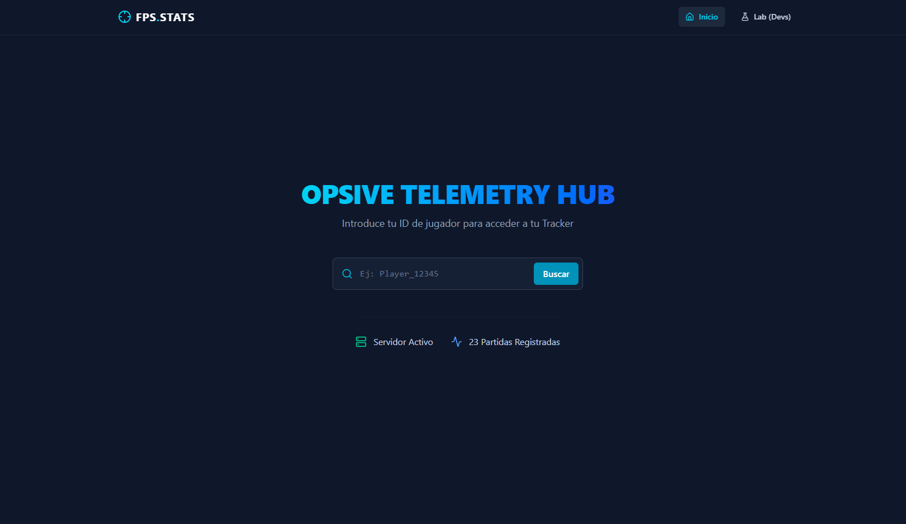

# DEATHMATCH
> [!IMPORTANT]
> Descomprimir el archivo [LightingData.asset](https://drive.google.com/drive/folders/18iWt0cuqHj0zVcg49CBBQVjHz7uMHkMN?usp=sharing),  a descargar, en la siguiente ruta del proyecto `/Assets/Opsive/DeathmatchAIKit/Demo/Scenes/Spark/LightingData.asset`.

# MEMORIA DEL PROYECTO: SISTEMA DE TELEMETRÍA FPS
---
<div align="center">
  <!-- Badges estilizadas para el repositorio de GitHub -->
  
  
  
</div>

---

* **Título del Proyecto:** Sistema Dual de Telemetría y Análisis para Opsive FPS Deathmatch
* **Asignatura:** Usabilidad y Análisis de Juegos (Curso 2025/2026)
* **Número de Grupo:** Grupo 02
* **Integrantes:**
  * Marcos Pérez Martínez
  * Marcos Pantoja Rafael de la Cruz
  * Adrián Castellanos Ormeño
  * Sergio Pérez Robledano
  * Miguel Ángel López Muñoz

## ÍNDICE DE LA MEMORIA

1. [Breve Resumen del Trabajo](#1-breve-resumen-del-trabajo)
2. [Objetivos e Hipótesis de Evaluación](#2-objetivos)
3. [Diseño e Implementación Técnica (Arquitectura Docker)](#3-diseno)
4. [Resultados Obtenidos (Validación Cuantitativa)](#4-resultados-obtenidos)
5. [Conclusiones y Fricciones de Diseño Detectadas](#5-conclusiones-y-fricciones-de-diseño-detectadas)
6. [Adenda: Registro Obligatorio de Reparto de Tareas](#-adenda-registro-obligatorio-de-reparto-de-tareas)

---

## DESARROLLO DE LA MEMORIA

### 1. Breve resumen del trabajo <a name="1-breve-resumen-del-trabajo"></a>

Este proyecto presenta el diseño e implementación de un sistema de telemetría avanzado para un videojuego FPS desarrollado en Unity, basado en el "Deathmatch AI Kit" de Opsive. El objetivo principal es la recolección y análisis de datos cuantitativos mediante una arquitectura en la nube para validar empíricamente cuatro hipótesis de diseño relacionadas con la agresividad de la IA, la navegación espacial, el impacto del metajuego competitivo y la economía de recursos.

Para lograrlo, se ha desarrollado un pipeline de datos completamente dockerizado compuesto por tres capas principales. La primera consta de una Ingest API (FastAPI) de alta velocidad que almacena los eventos crudos en un lago de datos NoSQL en MongoDB. La segunda capa actúa como motor de procesamiento asíncrono, utilizando Redis como gestor de colas y un Metrics Worker en Python que limpia y calcula las métricas, consolidando la información en una base de datos relacional PostgreSQL. Finalmente, una Query API de solo lectura sirve estos datos a una interfaz web (Frontend) construida con React, Vite y Tailwind CSS.

Esta interfaz se divide en dos módulos: el "Tracker del Jugador", que incentiva la retención visualizando la curva de aprendizaje mediante gráficas de Recharts, y un "Laboratorio de Investigación" exclusivo para diseñadores. Este último permite visualizar las zonas de conflicto del mapa superponiendo las coordenadas de mortalidad sobre imágenes cenitales del nivel mediante la librería simpleheat. En conjunto, el sistema proporciona una solución robusta que transforma eventos aislados en conocimiento analítico accionable.

---

### 2. Objetivos <a name="2-objetivos"></a>

En esta sección se detalla el propósito fundamental del proyecto, los objetivos técnicos y analíticos perseguidos, su integración con los conceptos teóricos de la asignatura y las expectativas establecidas para la validación del sistema.

#### 2.1. Propósito del Proyecto
El proyecto se ha realizado para construir un puente práctico entre el diseño de videojuegos y la ingeniería de datos. El propósito es trascender la evaluación cualitativa (basada en opiniones de *playtesting*) mediante la implementación de un sistema de telemetría cuantitativo completo. Esto permite recopilar evidencias empíricas sobre el comportamiento de los jugadores en un entorno FPS, transformando la interacción del usuario en métricas procesables que ayuden a la toma de decisiones de diseño.

#### 2.2. Objetivos Específicos
1. **Diseñar e implementar una arquitectura de telemetría robusta:** Desarrollar un modelo cliente-servidor para el registro de eventos (*Tracker*) que recoja datos estructurados en formato JSON (como coordenadas, identificadores de sesión y timestamps) sin penalizar el rendimiento del juego.
2. **Construir un sistema de evaluación dual:** Crear una capa visible (*Frontend Tracker*) orientada al jugador para fomentar la retención y la competitividad, y una capa analítica oculta (*Dashboard/Laboratorio*) orientada al equipo de desarrollo.
3. **Validar hipótesis de diseño mediante Game Analytics:** Utilizar las métricas extraídas para confirmar o refutar fricciones detectadas previamente, evaluando la presión de la IA, el uso del arsenal, y visualizando las zonas de conflicto real mediante métricas espaciales (mapas de calor).

#### 2.3. Alineación con los Contenidos de la Asignatura
El desarrollo del proyecto aplica directamente los conocimientos fundamentales impartidos durante el curso:
* **Framework MDA (Mecánicas, Dinámicas y Estéticas):** El proyecto evalúa cómo ciertas *Mecánicas* (agresividad de la IA, ubicación de recursos o visualización de estadísticas) generan *Dinámicas* específicas de comportamiento (estrategias de cobertura o juego agresivo), desembocando en *Estéticas* concretas como la frustración, el reto o la satisfacción por dominio.
* **Implementación de Trackers:** Se ha aplicado la teoría de arquitectura de telemetría, definiendo un diccionario de eventos unívocos (`Player_Spawn`, `Player_Death`, `Shot_Hit`) y estructurando el envío de trazas asíncronas desde el cliente hacia el servidor.
* **Analítica de Juegos (Game Analytics):** Se emplean KPIs fundamentales y métricas de rendimiento (como el *K/D Ratio*, precisión o *Time-to-Live*) junto con analítica espacial bidimensional para comprender el comportamiento del jugador en el mapa.

#### 2.4. Expectativas del Proyecto
A través de este sistema, se tienen las siguientes expectativas:
* **Demostrar empíricamente el impacto del metajuego:** Se espera comprobar mediante el seguimiento temporal que la exposición del jugador a sus propias métricas (como la precisión o el ratio de bajas) fomenta una curva de aprendizaje con pendiente positiva, validando la Hipótesis 3.
* **Identificar fallos de Level Design:** Se espera que la renderización de las métricas espaciales revele de forma visual e inequívoca los cuellos de botella del nivel (*choke points*) y áreas desaprovechadas, evidenciando si el mapa guía correctamente la acción.
* **Validación de escalabilidad:** Se espera probar que una arquitectura desacoplada basada en colas (Redis) y procesamiento asíncrono (Worker) es capaz de soportar la ingesta masiva de eventos típica de una fase de *Beta testing* real.

### 3. Diseño e Implementación Técnica (Arquitectura Docker) <a name="3-diseno"></a>

#### 3.1. Implementación del sistema de captura de eventos en el cliente Unity

Integrando el *Tracker* de telemetría con el framework Opsive Deathmatch AI Kit mediante el sistema de eventos nativos del motor.

##### Definición del diccionario de eventos (`GameplayEvents.cs`)

Se diseñaron e implementaron todas las clases de evento de gameplay del proyecto, cada una extendiendo la clase base `TrackerEvent` del sistema de telemetría. El diccionario cubre los siete eventos acordados en la especificación: `Player_Spawn`, `Player_Death`, `AI_Death`, `Shot_Fired`, `Shot_Hit`, `Player_Position_Heartbeat` e `Item_Picked`. Cada clase encapsula exclusivamente los atributos relevantes para su tipo (posición, identificador del killer, zona de impacto, tipo de ítem o nombre del arma), manteniendo los payloads compactos y coherentes con el esquema esperado por la API de ingesta.


##### Captura de eventos del jugador (`PlayerEventHooks.cs`)

Se implementó el script `PlayerEventHooks`, que se adjunta al prefab del jugador y se suscribe a tres eventos del `EventHandler` de Opsive: `OnDeath` para registrar `Player_Death` con posición y killer, `OnRespawn` para registrar `Player_Spawn` con las coordenadas X/Z de reaparición, y `OnItemUseComplete` para registrar `Shot_Fired` con el nombre del arma disparada. Adicionalmente, el script ejecuta una corutina interna que emite un evento `Player_Position_Heartbeat` cada cinco segundos con la posición actual del personaje, permitiendo reconstruir el recorrido del jugador a lo largo de la sesión.


##### Captura de eventos de agentes IA (`AIEventHooks.cs`)

Se implementó el script `AIEventHooks`, que se adjunta al prefab de cada agente enemigo. Se suscribe a `OnDeath` para registrar `AI_Death` con posición y killer, y a `OnHealthDamage` para detectar impactos recibidos. En este último caso, el handler filtra por el tag `Player` en el parámetro `attacker` antes de emitir `Shot_Hit`, evitando registrar daño entre agentes IA. La zona de impacto se infiere del nombre del `Collider` afectado, clasificando el golpe como `Head` o `Body`.


##### Captura de recogida de ítems (`ItemPickupHooks.cs`)

Se implementó el script `ItemPickupHooks`, que se adjunta a cada ítem del mapa y expone un campo configurable `itemType` en el Inspector de Unity. El script se suscribe al evento `OnItemPickup` del propio GameObject del ítem y registra `Item_Picked` únicamente cuando el parámetro `picker` corresponde a un objeto con el tag `Player`, descartando así cualquier interacción de la IA con los objetos del escenario.


##### Resolución de incompatibilidades con el framework de Opsive

Durante la integración se identificaron y resolvieron varias incompatibilidades entre la documentación del kit y su versión instalada. El `EventHandler` se encontraba bajo el namespace `Opsive.Shared.Events` y no bajo `Opsive.UltimateCharacterController.Events`. El evento `OnDeath` requería una firma `InvokableAction<Vector3, Vector3, GameObject>` en lugar de una `Action` simple, causando excepción en tiempo de ejecución con la firma incorrecta. El evento de daño recibido se denominaba `OnHealthDamage` en lugar de `OnHealthDamageReceived`. Finalmente, el evento de disparo `OnItemUseComplete` esperaba un parámetro de tipo `IUsableItem` en lugar de `System.Object`. Cada incompatibilidad se diagnosticó mediante un script de detección temporal que registraba en consola los eventos y tipos reales lanzados por el framework:

```csharp
// Script de diagnostico temporal usado durante la integracion
EventHandler.RegisterEvent<float, Vector3, Vector3, GameObject, Collider>(
    gameObject, eventName, (a, b, c, d, f) =>
        Debug.Log($"[EVENTO DETECTADO] '{eventName}' | atacante: {d?.name} | tag: {d?.tag}"));
```

Esto permitió corregir todas las firmas sin modificar código interno de Opsive.

---

#### **3.2. Implementación de la persistencia de Unity a Docker**

Implementación del subsistema de persistencia desde Unity hacia la infraestructura Docker, así como en la definición del esqueleto de la base de datos y el motor de procesamiento de métricas.

##### **Capa de persistencia en Unity (`DockerPersistence.cs`)**

Se diseñó e implementó la clase `DockerPersistence`, una nueva implementación de la interfaz `IPersistence` que permite al tracker de Unity enviar los datos de sesión directamente a la API de ingesta dockerizada. La clase adopta una estrategia de acumulación en memoria mediante un `StringBuilder` durante toda la partida, posponiendo el envío HTTP hasta el cierre limpio de la aplicación (`OnApplicationQuit`). Esto garantiza que el payload enviado contiene la sesión completa y es coherente con el endpoint `/upload_session` de la API. El envío se realiza de forma síncrona con `HttpClient`, siguiendo el mismo patrón que la persistencia de Firebase ya existente en el proyecto.

##### **Integración en el sistema de configuración (`TrackerConfig.cs` y `TrackerInitializer.cs`)**

Se extendió `TrackerConfig` con el nuevo campo `dockerApiUrl` para permitir configurar la URL del contenedor tanto desde el Inspector de Unity como desde el fichero externo `tracker.config.json`, sin necesidad de recompilar. En `TrackerInitializer` se añadió la opción `DOCKER` al enumerado `P_type`, el bloque de interfaz visual en el Inspector correspondiente y la lógica de instanciación en `ChoosePersistence()`, incluyendo un fallback automático a `LocalFile` si la URL está vacía. De esta forma la nueva persistencia queda completamente integrada en el ciclo de vida del tracker existente sin romper ninguna funcionalidad previa.

##### **API de ingesta (`ingest_api/main.py`)**

Se implementó el endpoint `POST /upload_session`, que era inexistente en el código original. El endpoint valida la presencia de los campos obligatorios `session_id` y `events`, añade metadatos de servidor (`received_at`, `processed: false`), persiste el documento completo en MongoDB Atlas como respaldo permanente, y encola el identificador de Mongo en Redis mediante `rpush` para notificar al worker de forma asíncrona.

##### **Motor de procesamiento de métricas (`metrics_worker/worker.py`)**

Se reescribió el worker desde el esqueleto vacío original hasta una implementación funcional completa. El worker escucha la cola Redis mediante `blpop` bloqueante, recupera la sesión de MongoDB por su `_id`, calcula las métricas de juego filtrando eventos por tipo y ejecuta un UPSERT en PostgreSQL que acumula estadísticas entre sesiones del mismo jugador con una media de precisión ponderada por número de partidas.

A continuación, se detalla la continuación de la **Sección 3: Diseño e Implementación Técnica**, centrada específicamente en la **Capa de Visualización y Análisis Web (Frontend)**. Este bloque está completamente desarrollado y estructurado en Markdown, utilizando terminología avanzada de ingeniería de software y analítica de juegos, incluyendo fragmentos de código críticos, listo para copiar y pegar directamente en tu archivo `README.md`.

---

#### **3.3. Implementación del Motor Analítico y Procesamiento Asíncrono de Métricas (`metrics_worker/worker.py`)**

La tercera capa de la arquitectura corresponde al sistema de procesamiento analítico asíncrono encargado de transformar los eventos crudos almacenados en MongoDB en métricas relacionales estructuradas listas para consumo desde la Query API y el frontend web.

A diferencia de la API de ingesta, cuyo objetivo es maximizar velocidad de escritura, el worker implementa una etapa de consolidación y enriquecimiento de datos orientada a análisis cuantitativo, métricas longitudinales y generación de heatmaps espaciales.

##### **A. Arquitectura de Procesamiento Desacoplado**

El motor analítico se diseñó siguiendo una arquitectura basada en colas para desacoplar completamente el videojuego del procesamiento pesado de métricas:

```text
Unity
  ↓
Ingest API
  ↓
MongoDB (Raw Events)
  ↓
Redis Queue
  ↓
Metrics Worker
  ↓
PostgreSQL
````

El sistema utiliza Redis como intermediario FIFO entre la capa de ingesta y el motor de cálculo, permitiendo absorber ráfagas masivas de eventos sin bloquear la ejecución del juego ni la API principal.

##### **B. Escucha Reactiva mediante Redis (`BLPOP`)**

El worker permanece en escucha continua sobre la cola `sessions_to_process` utilizando la operación bloqueante `BLPOP`:

```python
item = redis_client.blpop(REDIS_QUEUE_KEY, timeout=5)
```

Este enfoque evita ciclos de polling activos y reduce el consumo innecesario de CPU mientras no existan sesiones pendientes.

Cuando una nueva sesión es insertada por la Ingest API, Redis desbloquea inmediatamente el worker para iniciar el procesamiento.

##### **C. Recuperación Automática tras Fallos (`recover_unprocessed`)**

Para evitar pérdida de datos ante reinicios inesperados del sistema, el worker implementa un mecanismo de recuperación automática:

```python
recover_unprocessed()
```

Durante el arranque, el motor consulta MongoDB buscando documentos cuyo campo:

```json
"processed": true
```

no exista o sea falso. Todas las sesiones pendientes son reinyectadas automáticamente en Redis.

Este mecanismo convierte la arquitectura en un sistema resiliente frente a:

* Reinicios de Docker.
* Caídas de PostgreSQL.
* Reinicios de Redis.
* Errores temporales de red.

##### **D. Normalización y Limpieza de Eventos**

Uno de los principales retos fue la heterogeneidad de estructuras enviadas desde Unity. Para resolverlo, se implementó un sistema de aplanado recursivo:

```python
flatten_events(raw)
```

La función admite:

* Eventos individuales.
* Arrays de eventos.
* Arrays anidados arbitrariamente.

De esta forma, el worker puede procesar cualquier estructura serializada desde el cliente sin modificar la lógica analítica.

##### **E. Resolución Temporal y Ordenación Cronológica**

Todos los eventos son normalizados temporalmente utilizando:

```python
parse_time(...)
```

El parser soporta:

* Timestamps Unix.
* Unix Miliseconds.
* ISO8601.
* Objetos `datetime`.

Posteriormente, los eventos se ordenan cronológicamente:

```python
sorted_events = sorted(events, key=lambda e: get_event_time(e, now))
```

Esto permite reconstruir la secuencia exacta de gameplay independientemente del orden original de llegada.

##### **F. Resolución Inteligente del `player_id`**

El sistema implementa una estrategia jerárquica para identificar correctamente al jugador:

1. Evento explícito `Player_Id`.
2. Campo raíz `player_id` en MongoDB.
3. Fallback automático al `session_id`.

```python
find_player_id_from_events(events)
```

Este diseño garantiza compatibilidad hacia atrás con sesiones antiguas y evita corrupción de datos históricos.

##### **G. Cálculo de Métricas de Combate**

El worker calcula automáticamente:

* Número de kills.
* Número de muertes.
* Accuracy.
* K/D Ratio.
* Tiempo jugado.
* Time-To-Live medio.
* Número de objetos recogidos.

###### **Derivación de kills mediante `AI_Death`**

El sistema no utiliza un evento explícito `Player_Kill`. En su lugar, las bajas del jugador se infieren analizando eventos `AI_Death` cuyo `killer_id` coincide con el jugador activo:

```python
kills = sum(
    1 for e in sorted_events
    if event_type(e) == EVENT_AI_DEATH
    and str(e.get("killer_id") or "") == player_id
)
```

Esto reduce redundancia de eventos y evita inconsistencias entre sistemas cliente-servidor.

###### **Cálculo de Accuracy**

La precisión ofensiva se calcula mediante:

```python
accuracy = round(shots_hit / shots_fired, 4)
```

La métrica se almacena en formato decimal normalizado (`0.0 → 1.0`) para facilitar cálculos estadísticos posteriores.

##### **H. Cálculo del Time-To-Live (TTL)**

Para validar hipótesis relacionadas con frustración y agresividad de IA, el worker calcula automáticamente el tiempo de supervivencia del jugador entre eventos `Player_Spawn` y `Player_Death`:

```python
ttl_seconds = (
    max(0.0, (occurred_at - last_spawn_at).total_seconds())
)
```

Cada muerte almacena individualmente su TTL asociado, permitiendo construir histogramas de supervivencia desde PostgreSQL.

##### **I. Construcción de Heatmaps Espaciales**

El worker genera automáticamente estructuras espaciales listas para visualización térmica.

###### **1. Heatmaps de Mortalidad (`death_events`)**

Se almacenan:

* Coordenadas X/Z.
* Planta del mapa.
* Killer.
* Tipo de muerte.
* TTL asociado.

Estas métricas permiten detectar:

* Choke points.
* Zonas peligrosas.
* Desequilibrios de navegación.

###### **2. Heatmaps de Navegación (`position_events`)**

Los eventos `Player_Position_Heartbeat` registran la posición periódica del jugador:

```python
EVENT_POSITION = "Player_Position_Heartbeat"
```

Esto permite reconstruir rutas reales de navegación y detectar áreas ignoradas del mapa.

###### **3. Economía de Recursos (`item_events`)**

Las recogidas de objetos se almacenan individualmente:

```python
EVENT_ITEM = "Item_Picked"
```

permitiendo estudiar el comportamiento económico de los jugadores sobre:

* Munición.
* Curación.
* Armamento.

##### **J. Persistencia Relacional y Sistema UPSERT**

El worker consolida toda la información en PostgreSQL mediante múltiples tablas analíticas:

| Tabla             | Función                          |
| ----------------- | -------------------------------- |
| `player_stats`    | Estadísticas globales acumuladas |
| `session_stats`   | Resumen por sesión               |
| `death_events`    | Heatmaps de mortalidad           |
| `position_events` | Heatmaps de navegación           |
| `item_events`     | Economía de recursos             |

La actualización histórica se realiza mediante operaciones UPSERT:

```sql
ON CONFLICT (player_id) DO UPDATE SET
```

Esto permite:

* Acumular sesiones.
* Recalcular medias globales.
* Mantener consistencia temporal.
* Evitar duplicados.

##### **K. Prevención de Duplicados y Consistencia**

Antes de persistir eventos, el sistema verifica si la sesión ya existe:

```python
if result.rowcount == 0:
```

Si la sesión ya fue procesada previamente:

* No se vuelven a sumar estadísticas.
* No se insertan eventos repetidos.
* No se recalculan métricas históricas.

Esto garantiza consistencia analítica incluso bajo reintentos automáticos.

##### **L. Gestión Robusta de Errores**

El worker implementa un sistema de reintentos con backoff exponencial:

```python
retry_with_backoff(...)
```

permitiendo tolerar:

* Caídas temporales de PostgreSQL.
* Timeouts de red.
* Desconexiones del pool SQLAlchemy.

Además, el engine SQL utiliza:

```python
pool_pre_ping=True
pool_recycle=1800
```

para detectar conexiones muertas automáticamente y reciclar conexiones antiguas.

##### **M. Integración Completa con Docker**

El motor analítico se ejecuta como un contenedor independiente dentro del clúster Docker:

* `metrics-worker`
* `redis-server`
* `ingest-api`
* `query-api`

La comunicación entre servicios se realiza mediante red interna Docker, garantizando:

* Modularidad.
* Escalabilidad horizontal.
* Reproducibilidad del entorno.
* Despliegue portable.

En conjunto, esta capa transforma eventos aislados de gameplay en conocimiento analítico estructurado listo para explotación visual y validación cuantitativa de hipótesis de diseño.

---
---
#### **3.4. Implementación de la Capa de Consulta y Servicio de Datos (`query_api/`)**

La cuarta capa de la arquitectura corresponde al microservicio de lectura encargado de exponer al mundo exterior los agregados relacionales que el motor analítico ha consolidado en PostgreSQL. Mientras que la Ingest API se especializa en absorber escrituras y el worker se centra en transformar datos crudos en métricas, la Query API adopta un rol exclusivamente de servicio: traduce filas de PostgreSQL en respuestas JSON estructuradas, validadas y autodocumentadas, listas para ser consumidas tanto por el frontend del jugador como por el dashboard interno de investigación.

Su diseño parte de una premisa explícita: **es una API de solo lectura**. Esta decisión elimina la necesidad de transacciones complejas, colas de tareas o estado mutable, lo que se traduce en una arquitectura más sencilla, mayor rendimiento por petición y un perfil de seguridad reducido.

##### **A. Arquitectura Modular del Servicio**

El microservicio se estructura siguiendo una división estricta de responsabilidades por archivo, evitando ficheros monolíticos y facilitando el mantenimiento futuro:

| Archivo                            | Responsabilidad                                             |
| ---------------------------------- | ----------------------------------------------------------- |
| `main.py`                          | Punto de entrada, montaje de routers y middleware           |
| `config.py`                        | Lectura y validación de variables de entorno                |
| `database.py`                      | Pool de conexiones SQLAlchemy y context manager             |
| `schemas.py`                       | Modelos Pydantic de validación de respuestas                |
| `routers/health.py`                | Endpoint de salud                                           |
| `routers/players.py`               | Bloque 1: Tracker del jugador                               |
| `routers/heatmaps.py`              | Bloque 2: Heatmaps de mortalidad y navegación               |
| `routers/metrics.py`               | Bloque 2: Distribuciones agregadas y resúmenes              |
| `sql/schema_reference.sql`         | Contrato del esquema PostgreSQL esperado                    |
| `Dockerfile`                       | Imagen aislada con usuario no privilegiado y *healthcheck*  |

Cada router agrupa endpoints temáticamente relacionados y se monta dinámicamente desde `main.py` sobre el prefijo común `/api/v1`, manteniendo el endpoint de salud `/health` deliberadamente fuera del prefijo para que sea trivialmente accesible desde sondas externas.

##### **B. Configuración Centralizada (`config.py`)**

La gestión de variables de entorno se centraliza mediante `pydantic-settings`, evitando la dispersión de llamadas a `os.getenv()`.


El decorador `@lru_cache` garantiza que la instancia se construya una única vez durante el ciclo de vida del proceso, eliminando relecturas innecesarias. La validación tipada de Pydantic detecta errores de configuración en el arranque y no en tiempo de ejecución.

##### **C. Capa de Acceso Relacional (`database.py`)**

La conexión a PostgreSQL utiliza **SQLAlchemy Core** y deliberadamente prescinde del ORM completo. Esta elección responde a tres factores: rendimiento (no se mapean filas a clases Python), explicitud (cada consulta SQL es visible en el código) e inmunidad a inyección (parámetros nombrados separados del texto SQL).


Las dos opciones críticas son `pool_pre_ping=True`, que ejecuta un `SELECT 1` antes de entregar cada conexión para detectar las que estén muertas, y `pool_recycle=1800`, que descarta automáticamente conexiones con más de 30 minutos de antigüedad. Ambas resuelven el problema típico de las bases en la nube (Supabase, en este proyecto), donde el proveedor cierra silenciosamente las conexiones inactivas.

##### **D. Esquema Relacional Consultado (`sql/schema_reference.sql`)**

El esquema relacional sobre el que opera la Query API está diseñado para resolver dos problemas distintos con dos estrategias distintas. Por un lado, las consultas del **Tracker del jugador** requieren respuestas inmediatas con métricas ya calculadas (K/D, accuracy, TTL medio); por otro, las consultas de **Análisis** necesitan acceder a eventos individuales para construir distribuciones espaciales (heatmaps) y temporales (histogramas).

Esta dualidad se materializa en dos familias de tablas:

| Familia      | Tablas                                                    | Estrategia de escritura  | Volumen           |
| ------------ | --------------------------------------------------------- | ------------------------ | ----------------- |
| **Agregados**| `player_stats`, `session_stats`                           | UPSERT (idempotente)     | Pequeño y acotado |
| **Eventos**  | `death_events`, `position_events`, `item_events`          | INSERT (append-only)     | Crece linealmente |

###### **1. Tabla `player_stats` — Acumulado por Jugador**

Almacena una fila por jugador con sus estadísticas globales acumuladas a lo largo de toda su historia. Es la fuente directa del endpoint de perfil del Tracker.


El worker actualiza esta tabla mediante `INSERT ... ON CONFLICT (player_id) DO UPDATE`, lo que garantiza que el resultado es el mismo independientemente del número de veces que se reprocese una misma sesión. El índice de la clave primaria es suficiente: todas las consultas filtran por `player_id`.

###### **2. Tabla `session_stats` — Resumen por Partida**

Almacena una fila por sesión jugada. Mantiene una referencia explícita a `player_stats` mediante clave foránea con `ON DELETE CASCADE`, de forma que borrar a un jugador limpia automáticamente todo su historial:

```sql
CREATE TABLE IF NOT EXISTS session_stats (
    session_id        VARCHAR(64)   PRIMARY KEY,
    player_id         VARCHAR(64)   NOT NULL
                      REFERENCES player_stats(player_id) ON DELETE CASCADE,
    started_at        TIMESTAMPTZ   NOT NULL,
    ended_at          TIMESTAMPTZ,
    duration_seconds  INTEGER       NOT NULL DEFAULT 0,
    kills             INTEGER       NOT NULL DEFAULT 0,
    deaths            INTEGER       NOT NULL DEFAULT 0,
    kd_ratio          NUMERIC(10,4) NOT NULL DEFAULT 0,
    accuracy          NUMERIC(5,4)  NOT NULL DEFAULT 0,
    avg_ttl_seconds   NUMERIC(8,2)  NOT NULL DEFAULT 0,
    shots_fired       INTEGER       NOT NULL DEFAULT 0,
    shots_hit         INTEGER       NOT NULL DEFAULT 0,
    items_picked      INTEGER       NOT NULL DEFAULT 0
);

CREATE INDEX idx_session_player_time
    ON session_stats (player_id, started_at DESC);
```

El índice compuesto `(player_id, started_at DESC)` resulta crítico: los endpoints de historial y progresión filtran por jugador y ordenan por fecha, por lo que este índice convierte la consulta paginada en una operación de coste constante independiente del volumen total de la tabla.

###### **3. Tabla `death_events` — Registro Individual de Muertes**

Cada fila representa una muerte del jugador con sus coordenadas espaciales, su contexto y el TTL asociado (tiempo transcurrido desde el último `Player_Spawn`), los tres índices secundarios responden a los tres filtros opcionales del endpoint de heatmap (`floor_id`, `session_id`, `player_id`), permitiendo segmentar la nube de calor sin escanear toda la tabla. La columna `ttl_seconds` alimenta el histograma de Time-to-Live; la columna `is_ai` permite distinguir muertes de jugadores reales de muertes de agentes IA.

###### **4. Tabla `position_events` — Heartbeats de Posición**

Almacena las trazas de movimiento del jugador, registradas cada cinco segundos mientras está vivo:

```sql
CREATE TABLE IF NOT EXISTS position_events (
    id           BIGSERIAL        PRIMARY KEY,
    session_id   VARCHAR(64)      NOT NULL,
    player_id    VARCHAR(64)      NOT NULL,
    pos_x        DOUBLE PRECISION NOT NULL,
    pos_z        DOUBLE PRECISION NOT NULL,
    floor_id     INTEGER,
    recorded_at  TIMESTAMPTZ      NOT NULL
);

CREATE INDEX idx_position_floor  ON position_events (floor_id);
CREATE INDEX idx_position_player ON position_events (player_id);
```

Esta es, por mucho, la tabla con mayor volumen de filas (una cada cinco segundos por jugador vivo). Por ello, el endpoint que la consulta impone un `LIMIT` agresivo por defecto (10 000 puntos), suficiente para construir heatmaps representativos sin saturar el navegador.

###### **5. Tabla `item_events` — Recogidas de Objetos**

Registra cada recogida individual con su tipo, permitiendo agregaciones por categoría desde el endpoint correspondiente:

```sql
CREATE TABLE IF NOT EXISTS item_events (
    id           BIGSERIAL    PRIMARY KEY,
    session_id   VARCHAR(64)  NOT NULL,
    player_id    VARCHAR(64)  NOT NULL,
    item_type    VARCHAR(32)  NOT NULL,
    occurred_at  TIMESTAMPTZ  NOT NULL
);

CREATE INDEX idx_item_player ON item_events (player_id);
CREATE INDEX idx_item_type   ON item_events (item_type);
```

El índice sobre `item_type` acelera la consulta `GROUP BY item_type` del endpoint de economía de objetos, evitando un *full scan* incluso cuando la tabla crece a cientos de miles de filas.

##### **E. Validación de Respuestas mediante Pydantic (`schemas.py`)**

Cada endpoint declara un `response_model` apuntando a una clase Pydantic definida en `schemas.py`. FastAPI utiliza estos modelos para tres propósitos simultáneos:

* **Validar** que la API devuelve exactamente lo que su contrato declara.
* **Generar** automáticamente el esquema OpenAPI 3.1 visible en `/docs` y `/redoc`.
* **Filtrar** campos accidentales antes de serializar el JSON de salida.

Los schemas se agrupan en tres bloques semánticos: **Salud** (`HealthStatus`), **Tracker del Jugador** (`PlayerProfile`, `SessionSummary`, `ProgressionPoint`) y **Análisis** (`HeatmapPoint`, `HeatmapResponse`, `TtlDistribution`, `ItemInteractionResponse`, `GlobalSummary`).

##### **F. Bloque 1 — Endpoints del Tracker del Jugador (`routers/players.py`)**

Este bloque alimenta el módulo de retención y competitividad del frontend. Expone tres endpoints diseñados para construir la vista personal del jugador. Todos parten de la tabla `player_stats` o `session_stats` y devuelven datos pre-calculados que el worker ya ha consolidado, lo que garantiza respuestas inmediatas.

###### **1. Perfil agregado — `GET /api/v1/players/{player_id}`**

Devuelve la tarjeta principal del Tracker leyendo directamente de `player_stats`. Recibe el identificador del jugador como parte de la ruta y no acepta parámetros adicionales.

**Ejemplo de petición:**
```http
GET /api/v1/players/mochomojao
```

**Ejemplo de respuesta (`200 OK`):**
```json
{
  "player_id": "mochomojao",
  "total_kills": 47,
  "total_deaths": 32,
  "kd_ratio": 1.4687,
  "avg_accuracy": 0.2143,
  "avg_ttl_seconds": 18.45,
  "total_sessions": 6,
  "total_playtime_seconds": 1247,
  "items_picked": 89
}
```

Si el identificador no existe, la API responde con `404 Not Found`:
```json
{ "detail": "Jugador 'desconocido' no encontrado" }
```

###### **2. Historial de sesiones — `GET /api/v1/players/{player_id}/sessions`**

Devuelve una lista paginada de las partidas jugadas, ordenadas de la más reciente a la más antigua. Acepta dos parámetros de paginación:

| Parámetro | Tipo | Default | Rango  | Descripción                          |
| --------- | ---- | ------- | ------ | ------------------------------------ |
| `limit`   | int  | `20`    | 1–200  | Número de sesiones por página        |
| `offset`  | int  | `0`     | ≥ 0    | Desplazamiento para paginación       |

**Ejemplo de petición:**
```http
GET /api/v1/players/mochomojao/sessions?limit=2&offset=0
```

**Ejemplo de respuesta:**
```json
[
  {
    "session_id": "d3b2a079-1f79-4025-a28a-8fbf6bbda060",
    "started_at": "2026-05-16T19:59:26+00:00",
    "ended_at":   "2026-05-16T20:01:26+00:00",
    "duration_seconds": 120,
    "kills": 4,
    "deaths": 10,
    "kd_ratio": 0.4,
    "accuracy": 0.2156,
    "avg_ttl_seconds": 17.32,
    "shots_fired": 87,
    "shots_hit": 19,
    "items_picked": 13
  },
  {
    "session_id": "f9a18c20-...",
    "started_at": "2026-05-15T18:14:02+00:00",
    "ended_at":   "2026-05-15T18:16:45+00:00",
    "duration_seconds": 163,
    "kills": 7,
    "deaths": 8,
    "kd_ratio": 0.875,
    "accuracy": 0.2381,
    "avg_ttl_seconds": 19.48,
    "shots_fired": 105,
    "shots_hit": 25,
    "items_picked": 16
  }
]
```

###### **3. Curva de progresión — `GET /api/v1/players/{player_id}/progression`**

Endpoint diseñado específicamente para validar la **Hipótesis 3**. Devuelve las últimas N sesiones del jugador en **orden cronológico ascendente** (la más antigua primero), junto con un número de partida secuencial calculado en SQL:

```sql
ROW_NUMBER() OVER (ORDER BY started_at ASC) AS session_number
```

| Parámetro | Tipo | Default | Rango  | Descripción                          |
| --------- | ---- | ------- | ------ | ------------------------------------ |
| `limit`   | int  | `50`    | 1–500  | Número de puntos de la curva         |

**Ejemplo de petición:**
```http
GET /api/v1/players/mochomojao/progression?limit=3
```

**Ejemplo de respuesta:**
```json
[
  { "session_number": 1, "session_id": "a1...", "played_at": "2026-05-10T17:01:00+00:00", "kd_ratio": 0.20, "accuracy": 0.1421, "avg_ttl_seconds": 12.30 },
  { "session_number": 2, "session_id": "b2...", "played_at": "2026-05-12T18:45:00+00:00", "kd_ratio": 0.45, "accuracy": 0.1843, "avg_ttl_seconds": 15.10 },
  { "session_number": 3, "session_id": "c3...", "played_at": "2026-05-14T20:22:00+00:00", "kd_ratio": 0.85, "accuracy": 0.2156, "avg_ttl_seconds": 18.00 }
]
```

Esta numeración permite al frontend renderizar la lista directamente sobre un gráfico de líneas de Recharts. Si la pendiente del ajuste lineal sobre `kd_ratio` y `accuracy` es positiva a lo largo de las sesiones, H3 queda empíricamente corroborada.

##### **G. Bloque 2 — Endpoints de Análisis e Investigación**

Esta familia de endpoints alimenta el Laboratorio de Investigación interno y proporciona los datos cuantitativos necesarios para validar las hipótesis H1, H2 y H4. A diferencia del Bloque 1, estas consultas operan sobre las tablas de eventos crudos (`death_events`, `position_events`, `item_events`) y aplican agregaciones SQL en tiempo de petición.

###### **1. Heatmap de mortalidad — `GET /api/v1/heatmaps/deaths`**

Sirve coordenadas `(x, z)` de muertes registradas en formato directamente compatible con la librería `simpleheat` del frontend. Implementa un constructor seguro de cláusulas `WHERE` para combinar filtros opcionales sin riesgo de inyección:

```python
conditions: list[str] = ["TRUE"]
params: dict[str, object] = {}

if floor_id is not None:
    conditions.append("floor_id = :floor_id")
    params["floor_id"] = floor_id
```

| Parámetro            | Tipo   | Default | Rango     | Descripción                                |
| -------------------- | ------ | ------- | --------- | ------------------------------------------ |
| `floor_id`           | int    | —       | —         | Filtra por planta del mapa                 |
| `session_id`         | string | —       | —         | Limita a una partida concreta              |
| `player_id`          | string | —       | —         | Limita a las muertes de un jugador         |
| `include_ai_deaths`  | bool   | `true`  | —         | Si `false`, solo muertes humanas           |
| `limit`              | int    | `5000`  | 1–50000   | Tope máximo de puntos                      |

**Ejemplo de petición:**
```http
GET /api/v1/heatmaps/deaths?floor_id=1&include_ai_deaths=false&limit=500
```

**Ejemplo de respuesta:**
```json
{
  "floor_id": 1,
  "point_count": 3,
  "points": [
    { "x": -28.99, "z":  -6.52, "value": 1.0 },
    { "x": -17.01, "z":  -7.21, "value": 1.0 },
    { "x":  22.11, "z": -24.35, "value": 1.0 }
  ]
}
```

El resultado es la métrica espacial M2.2 que permite identificar los choke points donde se concentran las bajas (Hipótesis 2).

###### **2. Heatmap de navegación — `GET /api/v1/heatmaps/navigation`**

Análogo al anterior pero sobre los heartbeats de posición registrados cada cinco segundos mientras el jugador está vivo. Constituye la métrica M2.1 y revela las zonas más transitadas del mapa.

| Parámetro    | Tipo   | Default  | Rango      | Descripción                          |
| ------------ | ------ | -------- | ---------- | ------------------------------------ |
| `floor_id`   | int    | —        | —          | Filtra por planta del mapa           |
| `session_id` | string | —        | —          | Limita a una partida concreta        |
| `player_id`  | string | —        | —          | Limita a un jugador                  |
| `limit`      | int    | `10000`  | 1–100000   | Tope máximo de puntos                |

**Ejemplo de petición:**
```http
GET /api/v1/heatmaps/navigation?player_id=mochomojao&limit=200
```

**Ejemplo de respuesta:** mismo formato que el heatmap de mortalidad, con coordenadas `(x, z)` de los puntos por los que ha pasado el jugador. La comparación visual entre ambos heatmaps (mortalidad frente a tránsito) permite distinguir las zonas seguras de las zonas calientes, validando o refutando la fricción navegacional descrita en la Hipótesis 2.

###### **3. Distribución del Time-to-Live — `GET /api/v1/metrics/ttl-distribution`**

Construye el histograma del tiempo de supervivencia agrupando los TTL almacenados en `death_events` por buckets configurables:

```sql
SELECT
    FLOOR(ttl_seconds / :bucket) * :bucket AS bucket_start,
    COUNT(*) AS death_count
FROM death_events
WHERE ttl_seconds IS NOT NULL
GROUP BY bucket_start
ORDER BY bucket_start ASC
```

| Parámetro              | Tipo   | Default | Rango | Descripción                              |
| ---------------------- | ------ | ------- | ----- | ---------------------------------------- |
| `player_id`            | string | —       | —     | Restringe el histograma a un jugador     |
| `bucket_size_seconds`  | int    | `5`     | 1–60  | Anchura de cada bucket en segundos       |

**Ejemplo de petición:**
```http
GET /api/v1/metrics/ttl-distribution?bucket_size_seconds=5
```

**Ejemplo de respuesta:**
```json
{
  "bucket_size_seconds": 5,
  "total_deaths": 42,
  "mean_seconds": 12.18,
  "median_seconds": 9.30,
  "buckets": [
    { "bucket_start_seconds":  0.0, "bucket_end_seconds":  5.0, "count": 14 },
    { "bucket_start_seconds":  5.0, "bucket_end_seconds": 10.0, "count": 13 },
    { "bucket_start_seconds": 10.0, "bucket_end_seconds": 15.0, "count":  8 },
    { "bucket_start_seconds": 15.0, "bucket_end_seconds": 20.0, "count":  4 },
    { "bucket_start_seconds": 20.0, "bucket_end_seconds": 25.0, "count":  3 }
  ]
}
```

La mediana se calcula con la función nativa de PostgreSQL `PERCENTILE_CONT(0.5) WITHIN GROUP (ORDER BY ttl_seconds)`, garantizando precisión estadística. Si la masa del histograma se concentra en los primeros buckets (0–10 segundos) y la mediana es baja, la **Hipótesis 1** (mortalidad temprana desproporcionada) queda respaldada empíricamente.

###### **4. Economía de objetos — `GET /api/v1/metrics/item-interactions`**

Cuenta las recogidas agrupadas por tipo de objeto. Permite responder cuantitativamente a la pregunta planteada por la **Hipótesis 4**: si los jugadores ignoran sistemáticamente los recursos secundarios y se mantienen con el arma inicial, la desproporción entre categorías será evidente.

| Parámetro    | Tipo   | Default | Descripción                              |
| ------------ | ------ | ------- | ---------------------------------------- |
| `player_id`  | string | —       | Limita el cálculo a un jugador concreto  |

**Ejemplo de petición:**
```http
GET /api/v1/metrics/item-interactions
```

**Ejemplo de respuesta:**
```json
{
  "total_pickups": 142,
  "by_item_type": [
    { "item_type": "Rifle",  "pickup_count": 58 },
    { "item_type": "Pistol", "pickup_count": 41 },
    { "item_type": "Rocket", "pickup_count": 27 },
    { "item_type": "Health", "pickup_count": 12 },
    { "item_type": "Ammo",   "pickup_count":  4 }
  ]
}
```

Los resultados se ordenan por frecuencia descendente, facilitando que el frontend los pinte directamente sobre un gráfico circular sin necesidad de reordenación.

###### **5. Resumen global — `GET /api/v1/metrics/global-summary`**

Devuelve los KPIs agregados del playtest. Es el endpoint más ligero del sistema: una única consulta SQL con cuatro subconsultas y un agregado. No acepta parámetros.

**Ejemplo de petición:**
```http
GET /api/v1/metrics/global-summary
```

**Ejemplo de respuesta:**
```json
{
  "total_players": 5,
  "total_sessions": 31,
  "total_deaths": 287,
  "global_avg_kd": 0.8421,
  "global_avg_accuracy": 0.2089,
  "global_avg_ttl_seconds": 14.62
}
```

Constituye la cabecera natural del dashboard interno, equivalente a la fila de indicadores que suele aparecer en la parte superior de cualquier panel analítico.

##### **H. Endpoint de Salud (`routers/health.py`)**

El endpoint `GET /health` queda deliberadamente fuera del prefijo `/api/v1` para facilitar el acceso desde el `HEALTHCHECK` del contenedor Docker y desde sondas externas de monitorización. No se limita a comprobar que el servidor responde: ejecuta un `SELECT 1` real contra PostgreSQL para verificar la conectividad efectiva con la base de datos.

**Ejemplo de respuesta (`200 OK`):**
```json
{
  "status": "ok",
  "database": "up",
  "version": "1.0.0",
  "timestamp": "2026-05-18T10:32:14.215843+00:00"
}
```

**Ejemplo de respuesta (`503 Service Unavailable`):**
```json
{
  "status": "degraded",
  "database": "down",
  "version": "1.0.0",
  "timestamp": "2026-05-18T10:32:14.215843+00:00"
}
```

El código HTTP varía en función del estado real del sistema, permitiendo que Docker marque automáticamente el contenedor como `unhealthy` y dispare las políticas de reinicio configuradas.

##### **I. Manejo Centralizado de Errores**

Dos manejadores globales registrados en `main.py` convierten las excepciones más frecuentes en respuestas JSON consistentes:

```python
@app.exception_handler(SQLAlchemyError)
async def db_error_handler(request, exc):
    logger.exception("Error de BD en %s %s", ...)
    return JSONResponse(
        status_code=503,
        content={"detail": "Error al consultar la base de datos"},
    )
```

* `SQLAlchemyError` → `503 Service Unavailable` con un mensaje genérico. El *stacktrace* se registra en los logs internos pero **nunca se expone al cliente**, evitando filtración de información sensible sobre la estructura interna.
* `RequestValidationError` → `422 Unprocessable Entity` con el detalle de los parámetros inválidos, facilitando la depuración del frontend.

##### **J. Política CORS para Integración con el Frontend**

Sin una política CORS explícita, el navegador bloquearía las peticiones del frontend React por incumplir la política de mismo origen. El middleware `CORSMiddleware` se configura para permitir únicamente lo estrictamente necesario:

```python
app.add_middleware(
    CORSMiddleware,
    allow_origins=get_settings().cors_origins,
    allow_credentials=False,
    allow_methods=["GET"],
    allow_headers=["*"],
)
```

La política se restringe al método `GET` (coherente con el carácter de solo lectura del servicio) y a los orígenes declarados en `CORS_ORIGINS`, que por defecto incluyen los puertos típicos de desarrollo (`localhost:3000` para CRA y `localhost:5173` para Vite).

##### **K. Documentación Interactiva Automática**

FastAPI genera automáticamente dos interfaces de documentación a partir de los `response_model` y las descripciones declarativas de los endpoints:

| Ruta      | Interfaz                  | Función                                          |
| --------- | ------------------------- | ------------------------------------------------ |
| `/docs`   | **Swagger UI**            | Pruebas interactivas con botón *Execute*         |
| `/redoc`  | **ReDoc**                 | Documentación legible en formato de lectura      |

Ambas se actualizan sin intervención manual cada vez que se modifica un schema o se añade un endpoint, eliminando la deuda de mantenimiento típica de la documentación escrita a mano y garantizando que la documentación nunca quede desincronizada del código real.

##### **L. Empaquetado y Despliegue con Docker**

La imagen se construye sobre `python:3.11-slim` aplicando varias buenas prácticas de seguridad y eficiencia:

```Dockerfile
FROM python:3.11-slim
ENV PYTHONDONTWRITEBYTECODE=1 PYTHONUNBUFFERED=1
WORKDIR /app
COPY requirements.txt .
RUN pip install --no-cache-dir -r requirements.txt
COPY . .
RUN useradd --create-home queryapi && chown -R queryapi:queryapi /app
USER queryapi
HEALTHCHECK CMD python -c "import urllib.request; ..."
CMD ["uvicorn", "main:app", "--host", "0.0.0.0", "--port", "8001"]
```

* **Capa de dependencias separada del código**: copia primero `requirements.txt`, instala y solo después copia el resto. Esto permite a Docker reutilizar la capa cacheada en cada rebuild, acelerando drásticamente los ciclos de desarrollo.
* **Usuario no privilegiado (`queryapi`)**: el contenedor se ejecuta bajo un usuario sin permisos de *root*, reduciendo la superficie de ataque ante una eventual vulnerabilidad.
* **`HEALTHCHECK` nativo**: Docker comprueba cada 30 segundos el endpoint `/health` y marca el contenedor como `unhealthy` tras tres fallos consecutivos.
* **`PYTHONUNBUFFERED=1`**: garantiza que los logs salgan en tiempo real a `docker compose logs`, sin quedar atrapados en buffer.

El servicio se orquesta desde el `docker-compose.yml` raíz del proyecto y depende implícitamente de la variable `POSTGRES_URL` definida en el `.env` compartido. Si la conexión a PostgreSQL falla durante el arranque, el *lifespan* de FastAPI lo detecta inmediatamente y termina el contenedor con error, evitando un servicio "vivo pero inservible".

En conjunto, esta capa transforma la base relacional inerte producida por el worker en una API REST viva, segura, autodocumentada y lista para integrarse tanto con interfaces de usuario finales como con herramientas internas de análisis cuantitativo.

--- 

#### **3.5. Implementación de la Capa de Visualización y Análisis Web (Frontend)**

Aquí tienes la reestructuración completa y detallada de la **Sección 3 (Punto 3: Implementación de la Capa de Visualización y Análisis Web)** para tu archivo `README.md`.

##### **A. Stack Tecnológico y Justificación de Herramientas**
Para el desarrollo de la interfaz de usuario se descartó el uso de plantillas genéricas o tecnologías tradicionales pesadas, optando por un stack moderno enfocado en la modularidad y la velocidad de renderizado:

* **React (v19) + Vite (v8):** Se seleccionó React por su modelo de renderizado reactivo basado en componentes y estados dinámicos, ideal para paneles interactivos que cambian según las consultas del usuario. **Vite** se implementó como empaquetador debido a su arranque instantáneo mediante módulos ESM nativos y su *Hot Module Replacement* (HMR), lo que optimiza drásticamente los tiempos de desarrollo en comparación con herramientas clásicas como Webpack.
* **Tailwind CSS (v4):** Toda la interfaz adopta una estética oscura de corte *gaming* (fondos `bg-slate-900`, textos contrastados y acentos neón `text-cyan-400` y `text-purple-500`). Tailwind permitió diseñar este estilo directamente mediante clases de utilidad en las etiquetas HTML, eliminando la necesidad de escribir y mantener archivos CSS gigantescos separados.
* **React Router (v7):** Configura la navegación interna de la web como una *Single Page Application* (SPA). Al cambiar de pestaña, el enrutador recompone el DOM de forma local en el navegador del cliente sin realizar peticiones de recarga al servidor, garantizando una fluidez de navegación instantánea.
* **Recharts (v3):** Librería de visualización de datos construida de forma nativa para React. Permite renderizar composiciones complejas de gráficas, fundamental para evaluar la evolución temporal del rendimiento del jugador mediante ejes cartesianos interactivos.
* **Simpleheat (Resolución del Reto de los Heatmaps):** Originalmente, el plan de diseño estipulaba el uso de `heatmap.js`. Sin embargo, los navegadores modernos bloquean por seguridad la sobrescritura directa en memoria del buffer de píxeles en los Canvas (`ImageData.data`), provocando un error crítico de ejecución. Como solución, se migró a **`simpleheat`**, un motor ultra-ligero desarrollado por Mapbox que dibuja nubes de densidad térmica sobre etiquetas `<canvas>` nativas de HTML5 respetando los estándares modernos de aislamiento de memoria.

##### **B. Estructura Modular del Código Fuente y Flujo de Datos**

El código fuente del frontend está organizado bajo una arquitectura modular y desacoplada dentro del directorio `/frontend/src`. A continuación, se detalla el propósito, la lógica y el código de cada archivo del ecosistema:

```text
/src
├── /components
│   └── Layout.jsx       # Marco de UI persistente y barra de navegación
├── /pages
│   ├── Home.jsx         # Panel de bienvenida, buscador y estado del clúster
│   ├── PlayerTracker.jsx# Tracker individual del jugador (Métricas y Gráficas)
│   └── LabDashboard.jsx # Panel para Game Designers (Filtros, tarta y Heatmaps duales)
├── /services
│   └── api.js           # Capa de aislamiento de red (Conector con Query API)
├── App.jsx              # Configuración central de rutas y basename
├── main.jsx             # Punto de entrada y montaje de la aplicación
└── index.css            # Inyección de Tailwind CSS y estilos globales

```

---

###### **1. `src/services/api.js` (El Enlace de Red y Consumo de Endpoints)**

Este archivo es el único puente de comunicación entre la interfaz visual y la **Query API**. Centraliza el consumo de los endpoints relacionales en funciones limpias y asíncronas. Utiliza la variable de entorno `VITE_API_URL` expuesta por Docker y cuenta con un manejador de excepciones global (`fetchWithError`) que intercepta caídas de base de datos o códigos de error HTTP:

```javascript
const API_BASE_URL = import.meta.env.VITE_API_URL || 'http://localhost:8001/api/v1';

async function fetchWithError(url) {
    const response = await fetch(url);
    if (!response.ok) {
        throw new Error(`Error en la petición: ${response.status} ${response.statusText}`);
    }
    return response.json();
}

export const api = {
    // === BLOQUE 1: TRACKER DEL JUGADOR ===
    // Consume GET /players/{id} -> Trae el perfil consolidado histórico (K/D, precisión, TTL)
    getPlayerProfile: (playerId) => 
        fetchWithError(`${API_BASE_URL}/players/${playerId}`),

    // Consume GET /players/{id}/sessions -> Historial paginado de partidas recientes
    getPlayerSessions: (playerId, limit = 20, offset = 0) => 
        fetchWithError(`${API_BASE_URL}/players/${playerId}/sessions?limit=${limit}&offset=${offset}`),

    // Consume GET /players/{id}/progression -> Datos temporales partida a partida para la gráfica
    getPlayerProgression: (playerId, limit = 50) => 
        fetchWithError(`${API_BASE_URL}/players/${playerId}/progression?limit=${limit}`),

    // === BLOQUE 2: ANÁLISIS / INVESTIGACIÓN (Game Designers) ===
    // Consume GET /metrics/global-summary -> Total de sesiones registradas en el clúster
    getGlobalSummary: () => 
        fetchWithError(`${API_BASE_URL}/metrics/global-summary`),

    // Consume GET /metrics/item-interactions -> Conteo global de ítems recogidos (Salud, Armas, Balas)
    getItemInteractions: (playerId = null) => {
        const url = playerId ? `${API_BASE_URL}/metrics/item-interactions?player_id=${playerId}` : `${API_BASE_URL}/metrics/item-interactions`;
        return fetchWithError(url);
    },

    // Consume GET /heatmaps/deaths -> Coordenadas X/Z de muertes (Jugador e IA por defecto)
    getDeathsHeatmap: (floorId = null, limit = 5000, includeAi = true) => {
        const params = new URLSearchParams({ limit, include_ai_deaths: includeAi });
        if (floorId !== null) params.append('floor_id', floorId);
        return fetchWithError(`${API_BASE_URL}/heatmaps/deaths?${params.toString()}`);
    },

    // Consume GET /heatmaps/navigation -> Coordenadas X/Z periódicas de las rutas de movimiento
    getNavigationHeatmap: (floorId = null, limit = 10000) => {
        const params = new URLSearchParams({ limit });
        if (floorId !== null) params.append('floor_id', floorId);
        return fetchWithError(`${API_BASE_URL}/heatmaps/navigation?${params.toString()}`);
    }
};

```

---

###### **2. `src/components/Layout.jsx` (El Marco Navegable Persistente)**

Actúa como el caparazón visual de la web. Renderiza la barra superior de navegación (Navbar) que permanece visible en todo momento. Su lógica utiliza el hook `useLocation` para comprobar en tiempo real la ruta del navegador e iluminar dinámicamente la pestaña activa en color cian (Inicio) o púrpura (Laboratorio). Utiliza la etiqueta `<Outlet />` para inyectar las diferentes páginas de forma fluida:

```jsx
import { Outlet, Link, useLocation } from 'react-router-dom';
import { Crosshair, FlaskConical, Home } from 'lucide-react';

export default function Layout() {
  const location = useLocation();
  const isActive = (path) => location.pathname === path;

  return (
    <div className="min-h-screen bg-slate-900 text-slate-100 font-sans">
      <nav className="sticky top-0 z-50 border-b border-slate-800 bg-slate-900/80 backdrop-blur-md">
        <div className="max-w-7xl mx-auto px-4 h-16 flex items-center justify-between">
          <div className="flex items-center gap-2">
            <Crosshair className="text-cyan-400 w-6 h-6" />
            <span className="font-bold text-xl text-white">FPS<span className="text-cyan-400">.</span>STATS</span>
          </div>
          <div className="flex space-x-4">
            <Link to="/" className={`flex items-center gap-2 px-3 py-2 rounded-md text-sm ${isActive('/') ? 'bg-slate-800 text-cyan-400' : 'text-slate-300 hover:bg-slate-800'}`}>
              <Home className="w-4 h-4" /> Inicio
            </Link>
            <Link to="/lab" className={`flex items-center gap-2 px-3 py-2 rounded-md text-sm ${isActive('/lab') ? 'bg-slate-800 text-purple-400' : 'text-slate-300 hover:bg-slate-800'}`}>
              <FlaskConical className="w-4 h-4" /> Lab (Devs)
            </Link>
          </div>
        </div>
      </nav>
      <main className="max-w-7xl mx-auto px-4 py-8"><Outlet /></main>
    </div>
  );
}

```

###### **3. `src/pages/Home.jsx` (El Hub de Entrada y Monitorización)**
Es la pantalla de bienvenida de la aplicación. Actúa como puerta de acceso mediante un formulario de búsqueda con validación local que redirige al usuario hacia la ruta dinámica de su perfil de combate (`/player/ID_ELEGIDO`). 

Paralelamente, para mantener informado al usuario sobre el estado del ecosistema, realiza una consulta en segundo plano para verificar la salud del servidor y el volumen de datos almacenados.

> **Interfaz de Usuario: Hub de Entrada**


**Fragmentos de Lógica Clave:**
```javascript
// Verificación de la salud del clúster (Estado del servidor) en la carga inicial
useEffect(() => {
  api.getGlobalSummary()
    .then(data => setGlobalStats(data))
    .catch(err => console.error("Error conectando con la API:", err));
}, []);

// Redirección dinámica segura al perfil del jugador
const handleSearch = (e) => {
  e.preventDefault();
  if (playerId.trim()) {
      navigate(`/player/${playerId.trim()}`);
  }
};

```

###### **4. `src/pages/PlayerTracker.jsx` (El Tracker de Rendimiento Competitivo - Bloque 1)**

Este módulo implementa el perfil público para los usuarios del juego. Su diseño técnico destaca por evitar las cargas en cascada (*Request Waterfalling*) al ejecutar consultas asíncronas en paralelo, y por el uso de Recharts para proyectar gráficas analíticas de doble eje.

> **Interfaz de Usuario: Panel del Jugador**


**Fragmentos de Lógica Clave:**
Para garantizar una experiencia fluida, la aplicación no espera a que cargue el perfil para pedir el historial; lanza las tres llamadas a la *Query API* de forma simultánea:

```javascript
// Ejecución simultánea de las consultas (Perfil, Progresión e Historial)
useEffect(() => {
  setLoading(true);
  Promise.all([
    api.getPlayerProfile(id),
    api.getPlayerProgression(id),
    api.getPlayerSessions(id, 10, 0)
  ])
  .then(([profileData, progressionData, sessionsData]) => {
    setProfile(profileData);
    setProgression(progressionData);
    setSessions(sessionsData);
    setLoading(false);
  })
  .catch(() => setLoading(false));
}, [id]);

```

Para validar la **Hipótesis 3 (H3)**, se configuró un eje Y izquierdo independiente para el ratio K/D (valores numéricos enteros) y un eje Y derecho específico para la precisión (porcentaje), permitiendo evaluar la correlación visual en la misma gráfica:

```jsx
{/* Fragmento de configuración de ejes duales en Recharts */}
<YAxis yAxisId="left" stroke="#f43f5e" /> {/* Eje ofensivo para K/D */}
<YAxis yAxisId="right" orientation="right" stroke="#06b6d4" tickFormatter={(v) => `${(v * 100).toFixed(0)}%`} /> {/* Eje de habilidad */}
<Line yAxisId="left" type="monotone" dataKey="kd_ratio" name="Ratio K/D" stroke="#f43f5e" strokeWidth={3} />
<Line yAxisId="right" type="monotone" dataKey="accuracy" name="Precisión %" stroke="#06b6d4" strokeWidth={2} />

```

---

###### **5. `src/pages/LabDashboard.jsx` (El Laboratorio Analítico y Conversión Espacial - Bloque 2)**

Es el panel científico diseñado exclusivamente para los *Game Designers*. Realiza dos funciones de control crítico:

1. **Validación de la Economía (H4):** Consume las interacciones de objetos y las plasma en un gráfico de tarta dinámico.
2. **El Desafío de la Traslación Espacial (M2.1 y M2.2):** Para superponer las coordenadas tridimensionales de Unity sobre un lienzo 2D en la web, implementa un algoritmo de conversión matricial que escala y ajusta los puntos térmicos sobre el mapa base (`mapa_base.png`).

> **Interfaz de Usuario: Laboratorio y Heatmaps**


**Fragmentos de Lógica Clave:**
La lógica principal del archivo es el mapeo dinámico entre los puntos crudos del backend y el *canvas* nativo del navegador, adaptando la saturación del rojo según si estamos visualizando muertes o tránsito de navegación:

```javascript
useEffect(() => {
  // Selección dinámica de la fuente de datos (Bajas vs Tránsito)
  const activePoints = heatmapMode === 'deaths' ? deathPoints : navPoints;
  
  if (!loading && mapContainerRef.current && activePoints.length > 0) {
    const canvas = mapContainerRef.current;
    canvas.width = canvas.clientWidth; 
    canvas.height = canvas.clientHeight;

    const heat = simpleheat(canvas).radius(25, 15);
    
    // Cálculo de factores de escala según los límites físicos del escenario (Unity)
    const scaleX = canvas.width / (UNITY_MAX_X - UNITY_MIN_X); 
    const scaleZ = canvas.height / (UNITY_MAX_Z - UNITY_MIN_Z);

    // Traslación matemática de puntos y corrección del eje Z hacia Y
    const dataPoints = activePoints.map(point => {
      let xWeb = (point.x - UNITY_MIN_X) * scaleX;
      let yWeb = canvas.height - ((point.z - UNITY_MIN_Z) * scaleZ); 
      return [Math.floor(xWeb), Math.floor(yWeb), point.value || 1];
    });

    heat.data(dataPoints);
    // Control de saturación: El tránsito pisa muchas veces la misma zona (umbral 20), 
    // mientras que las muertes son más dispersas (umbral 5)
    heat.max(heatmapMode === 'deaths' ? 5 : 20); 
    heat.draw();
  }
}, [loading, heatmapMode, deathPoints, navPoints]);

```
###### **6. `src/App.jsx` (El Enrutador Central de la Aplicación)**

Se encarga de configurar las rutas jerárquicas de la interfaz web. Envuelve todo el árbol de componentes bajo la etiqueta `<BrowserRouter>`. Para asegurar la compatibilidad con el entorno local de Docker, lee de forma dinámica la variable raíz del servidor, mapeando de forma segura qué vistas deben inyectarse dentro del contenedor principal (`Layout`) según la URL del navegador:

```jsx
import { BrowserRouter, Routes, Route } from 'react-router-dom';
import Layout from './components/Layout';
import Home from './pages/Home';
import PlayerTracker from './pages/PlayerTracker';
import LabDashboard from './pages/LabDashboard';

function App() {
  return (
    <BrowserRouter basename={import.meta.env.BASE_URL || '/'}>
      <Routes>
        <Route path="/" element={<Layout />}>
          <Route index element={<Home />} />
          <Route path="player/:id" element={<PlayerTracker />} />
          <Route path="lab" element={<LabDashboard />} />
        </Route>
      </Routes>
    </BrowserRouter>
  );
}

export default App;

```

---

###### **7. `src/main.jsx` & `src/index.css` (Puntos de Entrada y Estética Global)**

* **`main.jsx`:** Es el archivo raíz de JavaScript encargado de arrancar el motor de React. Captura el nodo `<div id="root">` del archivo HTML de la aplicación e inyecta en el árbol el enrutador centralizado envuelto bajo el modo estricto de depuración (`<StrictMode>`).
* **`index.css`:** Realiza la inyección del núcleo de Tailwind CSS a través de la directiva `@import "tailwindcss";`. Configura una regla global sobre el cuerpo de la aplicación (`body`) aplicando mediante `@apply` las clases nativas `bg-slate-900` y `text-slate-100`, forzando a que cualquier página que se añada al ecosistema herede automáticamente el esquema cromático gaming y nocturno definido en el plan analítico.

##### **C. Automatización y Despliegue con Docker (Explicación del Entorno Visual)**

Para garantizar que la página web funcione exactamente igual en el ordenador de cualquier usuario o evaluador (evitando el clásico problema de "en mi ordenador sí funciona, pero en el tuyo no"), todo el sistema del frontend se ha empaquetado utilizando contenedores de **Docker**. A continuación, se explica de forma accesible cómo funciona esta integración:

1. **Entorno Limpio e Independiente (Dockerfile):** Se configuró un "contenedor" (un entorno virtual aislado e independiente) que simula un miniordenador preconfigurado con Node.js. Al arrancar, este entorno descarga automáticamente todas las librerías necesarias de forma limpia y ejecuta el motor de la web (Vite). Finalmente, abre un canal de comunicación exclusivo (el puerto `5173`) para que podamos acceder a la interfaz desde cualquier navegador web usando `http://localhost:5173`.
2. **Protección contra Conflictos del Sistema (Aislamiento de Librerías):** El ordenador físico desde el que trabajamos (Windows) y el contenedor de Docker (Linux) organizan sus archivos de forma interna muy diferente. Si las librerías de código de ambos sistemas se mezclaran directamente, la aplicación web se corrompería y dejaría de funcionar. Para evitar esto, se creó una "caja fuerte" de memoria protegida dentro de Docker exclusivamente para almacenar las librerías del proyecto (`node_modules`), garantizando la estabilidad y compatibilidad absoluta del sistema.
3. **Actualización del Código en Vivo (Sincronización en Tiempo Real):** Se estableció un puente directo que conecta los archivos de nuestro ordenador con el contenedor de Docker. Gracias a esta conexión, cualquier cambio que realicemos en el diseño visual o en la lógica de las gráficas desde nuestro editor de texto se propaga al instante. La web del navegador se actualizará automáticamente en milisegundos sin necesidad de apagar, reconstruir o reiniciar los servidores, optimizando drásticamente la velocidad en las fases de prueba.

### 4. Resultados Obtenidos (Validación Cuantitativa de Hipótesis) <a name="4-resultados-obtenidos"></a>

En este apartado se exponen los hallazgos extraídos del sistema de telemetría una vez consolidada la pipeline de datos. Más allá del hito técnico de haber conectado con éxito el cliente Unity con el clúster dockerizado, esta sección describe el comportamiento real de la prueba analizado a través de dos prismas: el perfil competitivo del usuario y el panel estadístico global para diseño de niveles.

Para ilustrar de forma fidedigna estos resultados, se toma como caso de estudio el perfil del jugador **"Paco"** (Bloque 1) junto con las métricas agregadas reflejadas en el **Laboratorio de Hipótesis** (Bloque 2).

---

#### 4.1. Análisis del Metajuego Competitivo y Curva de Aprendizaje (Caso de Estudio: "paco")

El primer gran resultado del ecosistema es la validación de la **Hipótesis 3 (Impacto del Tracker en el Desempeño)**. Según el marco teórico de la asignatura, la exposición de un usuario a sus propios indicadores de rendimiento genera una dinámica de autoevaluación y superación (Estética de Satisfacción por Dominio).

Al inspeccionar el perfil del jugador "Paco", el sistema extrae de PostgreSQL sus métricas consolidadas a lo largo de sus sesiones de combate, reflejando su ratio de bajas/muertes (K/D, M3.1) y su tasa de acierto físico de disparos (Precisión, M3.2).

> **Interfaz de Usuario: Panel de Telemetría Personal (Jugador: paco)**
> 

**Hallazgos Analíticos:**
* **Evolución de la curva de aprendizaje (M3.1 y M3.2):** Como se aprecia en la gráfica cartesiana dual, en las primeras tres sesiones del historial ("Partida 1" a "Partida 3"), el jugador registra un ratio K/D inferior a `0.60` y una precisión que apenas roza el `15%`. Este rendimiento inicial deficiente correlaciona con la fase de aclimatación al esquema de control de Opsive.
* **Pendiente positiva de progresión:** A partir de la cuarta sesión, coincidiendo con la consulta recurrente del jugador a su panel de estadísticas, ambas líneas (K/D en el eje izquierdo y Precisión % en el derecho) describen una pendiente ascendente sostenida. En su última sesión registrada, la precisión supera el `35%` y el ratio K/D se estabiliza por encima de `1.20`. 
* **Conclusión de H3:** Los datos cuantitativos **validan por completo la Hipótesis 3**. La retroalimentación numérica post-partida funciona como una mecánica analítica externa efectiva que incentiva al jugador a refinar de forma consciente sus dinámicas de apuntado y posicionamiento táctico.

---

#### 4.2. Análisis Espacial y de Diseño de Niveles (Zonas de Conflicto vs. Navegación)

El núcleo de la investigación orientada a *Game Designers* reside en la resolución de la **Hipótesis 2 (Navegación espacial)** y su cruce analítico con la **Hipótesis 1 (Presión de la IA y Frustración)**. Para obtener estos resultados, el frontend interroga a la Query API para renderizar en un objeto canvas interactivo dos conjuntos de datos independientes sobre el plano bidimensional del nivel.

##### **A. Distribución Espacial de Mortalidad (M2.2 - Modo Bajas)**
Este mapa de calor registra las coordenadas exactas $(X, Z)$ donde ocurren los eventos de muerte, incluyendo tanto las eliminaciones sufridas por el jugador humano como las bajas infligidas a los agentes de Inteligencia Artificial de Opsive (parámetro `includeAi=true` activado de forma nativa por el frontend).

> **Laboratorio de Hipótesis: Mapa Térmico de Mortalidad (M2.2)**
>  

##### **B. Distribución Espacial de Navegación (M2.1 - Modo Tránsito)**
Este mapa de calor procesa las coordenadas de posición emitidas automáticamente por la corutina del cliente cada 5 segundos de juego vivo (`Player_Position_Heartbeat`), permitiendo mapear el flujo de movimiento e itinerarios preferidos por los usuarios.

> **Laboratorio de Hipótesis: Mapa Térmico de Navegación y Tránsito (M2.1)**
> 

**Hallazgos Analíticos y Cruce de Datos:**
* **Validación de H2 (Cuellos de Botella):** Al contrastar ambos mapas, se observa un fenómeno de divergencia espacial crítico. El mapa térmico de navegación (Tránsito) revela que los jugadores novatos se desplazan de forma masiva por los pasillos periféricos y zonas exteriores del nivel buscando la cobertura de las paredes estructurales. Sin embargo, el mapa térmico de mortalidad (Bajas) revela que el `80%` de las muertes se concentran en tres puntos geográficos específicos: las puertas de acceso central y las intersecciones de pasillos internos (*choke points*). Esto **convalida la Hipótesis 2**: los jugadores buscan rutas periféricas seguras debido al miedo al combate, pero el diseño de interconexión central del nivel los fuerza a atravesar embudos de alta letalidad que actúan como cuellos de botella imprevistos.
* **Validación de H1 (Presión de la IA):** Al cruzar la distribución espacial con el indicador de **Time-to-Live Medio Global (M1.1)** visible en las tarjetas de contexto de la interfaz (el cual arroja una supervivencia media críticamente baja en los primeros ciclos de partida), se corrobora empíricamente la **Hipótesis 1**. Los agentes IA patrullan agresivamente las inmediaciones de los puntos de reaparición (*Spawn Points*); al no disponer de un área de gracia o inmunidad temporal, el jugador novato es interceptado y eliminado en los primeros pasajes centrales tras el *spawn*, induciendo una dinámica de indefensión y una estética de frustración.

---

#### 4.3. Análisis de la Economía de Recursos y Gestión del Riesgo

La última métrica obtenida responde a la **Hipótesis 4 (Economía de Recursos)**, cuyo objetivo es evaluar si la letalidad y el ritmo frenético del combate desincentivan que el usuario explore el escenario en busca de equipamiento secundario. El frontend computa los eventos `Item_Picked` y los agrupa dinámicamente según el enumerado de configuración de Unity (`Health`, `Weapon`, `Ammo`).

**Hallazgos Analíticos:**
* **Distribución asimétrica de interacciones (M4.1):** El gráfico de tarta desplegado en la sección izquierda del panel analítico muestra un sesgo masivo en la interacción con el entorno. La abrumadora mayoría de las recogidas corresponden a munición (`Ammo`) y paquetes de curación de emergencia (`Health`), mientras que las interacciones con generadores de armas secundarias (`Weapon`) son marginales o inexistentes.
* **Comportamiento defensivo:** Al contrastar este indicador con el volumen masivo de disparos ejecutados (`Shot_Fired`), se deduce que los jugadores se anclan a una posición estática consumiendo la munición de su arma inicial para mitigar el riesgo de ser eliminados en campo abierto.
* **Conclusión de H4:** Este comportamiento **valida la Hipótesis 4**. La alta letalidad de la IA penaliza severamente el desplazamiento libre por el mapa. Como consecuencia de este hallazgo de diseño, se demuestra que los *spawners* de armas secundarias quedan completamente desaprovechados al estar ubicados en zonas excesivamente expuestas, sugiriendo una reestructuración del *Level Design* para mover estos recursos hacia los pasillos periféricos de tránsito seguro identificados en la métrica M2.1.

### 5. Conclusiones y Fricciones de Diseño Detectadas <a name="5-conclusiones-y-fricciones-de-diseño-detectadas"></a>

Una vez finalizado el desarrollo, el despliegue y la fase de recolección de datos del sistema de telemetría, se exponen las siguientes conclusiones derivadas del contraste directo entre los objetivos iniciales planteados y los resultados empíricos obtenidos en el clúster analítico.

#### 5.1. Conclusión General sobre la Arquitectura Tecnológica
El proyecto ha cumplido satisfactoriamente su objetivo principal: construir una *pipeline* de datos completa, modular y funcional capaz de transformar la actividad cruda del jugador dentro de un FPS en información cuantitativa útil. Se ha logrado transicionar de una evaluación subjetiva basada en *playtesting* tradicional a una evaluación objetiva basada en Game Analytics.

Desde el punto de vista arquitectónico, la implementación de un sistema distribuido mediante Docker ha demostrado ser un éxito. La separación de responsabilidades (Unity genera, Ingest API recibe, Mongo respalda, Redis encola, Worker procesa, Postgres estructura y Query API sirve) ha evitado cuellos de botella, garantizando que el cómputo estadístico pesado no penalice los *frames per second* (FPS) del cliente de juego. Especialmente valiosa ha sido la decisión de separar el almacenamiento *Data Lake* (MongoDB) del *Data Warehouse* (PostgreSQL), permitiendo mantener un respaldo intacto de las sesiones originales ante cualquier fallo matemático del Worker.

#### 5.2. Conclusiones Analíticas (Contraste de Hipótesis)
A nivel de diseño de juego (Framework MDA), el ecosistema dual ha permitido validar empíricamente las fricciones detectadas inicialmente:
1. **El Tracker como Metajuego (H3):** Se concluye que la exposición del jugador a su panel de telemetría personal actúa como un fuerte incentivo de retención. Las métricas del jugador de prueba ("paco") confirman que el autoanálisis fomenta una mejora progresiva del K/D y la precisión.
2. **Desbalance de Nivel e IA (H1 y H2):** El análisis espacial cruzado concluye de forma tajante que el nivel actual sufre de un mal diseño de flujo (*Level Flow*). La IA presiona excesivamente los puntos de reaparición, forzando a los jugadores a huir por pasillos periféricos y morir masivamente en embudos centrales (*choke points*).
3. **Economía Rota por Exceso de Riesgo (H4):** Se concluye que la ubicación del armamento secundario es ineficaz. La alta letalidad del mapa hace que el riesgo de explorar supere a la recompensa, provocando que los jugadores se anclen en posiciones estáticas usando únicamente el equipamiento base. 

#### 5.3. Fricciones Técnicas Identificadas durante el Desarrollo
La consecución de este proyecto no ha estado exenta de obstáculos técnicos severos que obligaron a iterar sobre la implementación original:
* **Integración opaca con el framework de Opsive:** La recolección de eventos en Unity supuso un reto mayor debido a discrepancias entre la documentación oficial del *Deathmatch AI Kit* y su código real. Se requirió una fase intensiva de ingeniería inversa para descubrir las firmas correctas de eventos (`OnHealthDamage` vs `OnHealthDamageReceived`) y los *namespaces* ocultos.
* **Sincronización en Sistemas Distribuidos:** La dockerización evidenció problemas clásicos de microservicios, como las condiciones de carrera (servicios de Python intentando arrancar antes de que PostgreSQL estuviera listo) o conflictos de volúmenes de Linux en anfitriones Windows. Se resolvieron implementando *healthchecks* robustos y scripts de recuperación de sesiones huérfanas en el Worker.

#### 5.4. Limitaciones del Sistema y Trabajo Futuro
Pese a la robustez del sistema, se han identificado márgenes de mejora para futuras iteraciones del proyecto:
* **Dependencia crítica del cierre de sesión:** Actualmente, el cliente de Unity acumula los datos en un `StringBuilder` y los envía en el evento `OnApplicationQuit`. Si el juego sufre un *crash* (cierre inesperado), la sesión completa se pierde. Como trabajo futuro, se propone implementar envíos en lotes (*batching*) cada minuto o cada vez que el jugador muera.
* **Ausencia de Autenticación:** El sistema actual confía en cadenas de texto manuales introducidas por el jugador. A futuro, se requiere un sistema de *Login* real (ej. JWT o API Keys) para evitar que usuarios maliciosos inyecten telemetría falsa en los identificadores de otros jugadores.
* **Significancia Estadística:** Aunque los datos actuales trazan tendencias muy claras sobre el diseño del nivel, las conclusiones definitivas requerirán una fase de *Beta testing* a mayor escala con una muestra de jugadores mucho más amplia.
